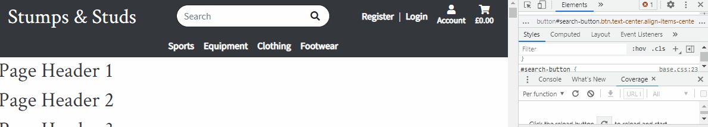
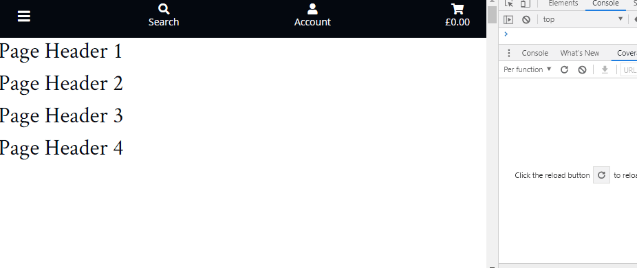
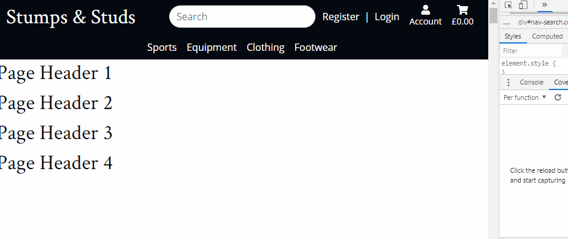

# Stumps and Studs

A fictional ecommerce website selling sports equipment and clothing.  Built using Django's Python framework.  Frontend developed using HTML, CSS & JavaScript with Bootstrap and jQuery libraries.  Backend built with Python (Django) utilising a Postrgres database.

## Demo

The final project is hosted on Heroku and can be found **TBC**

## Contents

1. [**UX**](#ux)
    * [**Project Aim**](#project-aim)
    * [**User Stories**](#user-stories)
    * [**Design Decisions**](#design-decisions)
    * [**Wireframes**](#wireframes)

2. [**Code**](#code)
    * [**Settings**](#settings)
    * [**File Structure**](#file-structure)
    * [**Static Files**](#static-files)    

3. [**Database Schema**](#database-schema)
    * [**Data Scheme**](#data-scheme)

4. [**Features**](#features)
    * [**Existing Features**](#existing-features)
    * [**Features Left To Implement**](#features-left-to-implement)

5. [**Languages**](#languages)

6. [**Services Used**](#services-used)

7. [**Testing**](#testing)
    * [**Bugs Encountered During Development**](#bugs-encountered-during-development)
    * [**Testing Process**](#testing-process)
    * [**Bugs Encountered During Testing**](#bugs-encountered-during-testing)

8. [**Deployment**](#deployment)
    * [**GitPod Environment**](#gitPod-environment)
    * [**Packages Installed**](#packages-installed)
    * [**Create The Django Project**](#create-the-django-project)
    * [**Environment Variables**](#environment-variables)
    * [**Setting Up The Database**](#setting-up-the-database)
    * [**Create Admin Superuser**](#create-admin-superuser)
    * [**Deploy Application To Heroku**](#deploy-application-to-heroku)
    * [**Connecting Django Application To Postrgres Database**](#connecting-django-application-to-postrgres-database)
    * [**Using Flask Template Inheritance**](#using-flask-template-inheritance)

9. [**Credits**](#credits)
    * [**Inspiration**](#inspiration)
    * [**Content**](#content)
    * [**Media**](#media)
    * [**Acknowledgements**](#acknowledgements)

## UX

### Project Aim

The aim of this project was to produce an enticing and fully-functioning e-commerce website.

### User Stories

* As a shopper/visitor to the website, I want to:
    -   Immediately understand the range of products the website sells.
    -   Easily navigate categories and search for products.
    -   View images of the products available to purchase.
    -	View the prices and details of each product.
    -	Select a size of product (where applicable).
    -	Select between right-handed and left-handed equipment (where applicable).
    -	Add multiple products to a basket.
    -	View items in my basket.
    -	Adjust the quantities of items in my product including removing them from the basket entirely.
    -	View the total cost of the items in my basket.
    -	View any delivery cost applicable and understand how much more cost I need to add to my basket in order to qualify for free delivery.
    -	Easily navigate to a checkout page.
    -	Contact the company.

* As a shopper/visitor who has decided to purchase one or more products, I want to:
    -	Exit the checkout process and return to the store so I can amend the products in my basket.
    -	Be able to provide personal details such as name and email address.
    -	Provide a delivery address for my products to be shipped to.
    -	Enter payment card details to complete a secure checkout.
    -	View my order and the total cost of it including delivery throughout the checkout process.
    -	See a confirmation message confirming that the order has been placed.
    -	Receive an email confirmation that the order has been placed.

* As a shopper/visitor who intends to return to the website in future, I want to:
    -	Create an account.
    -	Store my personal and default delivery address details.
    -	Update my account details.
    -	View my past orders.
    -   Sign in and out of my account.

* As an administrator of the website, I want to be able to:
    -	Use the admin panel to add products.
    -	Use the admin panel to update the details of products.
    -	Use the admin panel to delete products.
    -	Use the admin panel to delete users.

### Design Decisions

The fonts used throughout the website is Crimson Text for headers and Open Sans for all other elements.  I searched Google for some goo font pairings for ecommerce websites.  I came across [this website](https://www.builderfly.com/7-perfect-font-pairing-for-your-ecommerce-website/) and was enticed by the pairing of Crimson Text and Source Sans Pro.  However, whilst I was developing the header and navbar, I decided that Source Sans Pro font wasn't quite right for my website.  I turned to [Google Fonts](https://fonts.google.com/) to identify other fonts which make good partners to Crimson Text.  I ended up choosing Open Sans as the font to partner Crimson Text.

I visited a number of popular ecommerce website for inspiration in the colour palette and design.  [Asos.com](https://www.asos.com/men/), [Adidas](https://www.adidas.co.uk/) and also the [mini-project](https://mini-project-4-boutique-ado.herokuapp.com/) all demonstrate the simple use of predominantly black and white colour palettes with little colour used.  I think this helps ensure product images standout from the page and wanted to mirror this in my project.  I used [Coolors](https://coolors.co/) to help generate a colour scheme which incorporated a strong black but also other strong colours to help make certain sections and buttons of the website stand out.

I often find that ecommerce websites are very busy.  The amount of content visible on screen can detract focus away from the product images.  For example, navigation bars, filters and product details (price, description, ratings, etc) all lead to a lot of text on screen at any one time while searching for products.  Although some product information is useful, product images, name and cost are the most essential things a user is looking for in my opinion.  Further product details can be accessed by clicking on a product and viewing all of its information so there is no need to show it all on the main navigation page.  When researching ecommerce website for inspiration, I came across [this website](https://www.hardgraft.com/collections/footwear) which has a very stripped back layout, ensuring the product images take center stage.  This example really appealed to me.  For these reasons, I wanted to keep the real estate of the header and filters to a minimum and ensure the images were not cluttered with additional product information.

### Wireframes

## Code

### Settings

The settings.py file is where the global settings for the project are configured.  Django creates a lot of these by default but there were some changes/additions which needed to be made as I developed the project.

*   **Installed Apps**:  For each new Django app I created, the app name needed to be added to the list of installed apps (INSTALLED_APPS).
*   **Django AllAuth**:  AllAuth can be configured in the global settings.py file.  Installation instructions for AllAuth can be found [here](https://django-allauth.readthedocs.io/en/latest/installation.html) and configuration instructions can be found [here](https://django-allauth.readthedocs.io/en/latest/configuration.html).

### File Structure

The project is split into apps.  Each app has files (such as forms, models, urls and html files) which are specific to that app.  However, there are some common files which we want apps to inherit from or which don't necessarily belong within one of the apps.  These are stored in the templates folder.

Each HTML file extends from the base.html file which is saved in the templates folder.

The templates folder contains an 'allauth' subfolder which contains a number of the allauth template html files.  These were copied from the AllAuth site-packages directory using the following command before I then deleted the AllAuth openid and tests templates:
*   *cp -r ../.pip-modules/lib/python3.8/site-packages/allauth/templates/* ./templates/allauth*

### Static Files

## Database Schema

### Data Scheme

## Features

### Existing Features

### Features Left To Implement

## Languages

* HTML
* CSS
* JavaScript
* Python

## Technologies Used

 - [Django](https://www.djangoproject.com/)
 - [Bootstrap](https://getbootstrap.com/)
 - [jQuery](https://jquery.com/)
 - [Django AllAuth](https://django-allauth.readthedocs.io/en/latest/)

## Services Used

## Testing

### Bugs Encountered During Development

#### Search

Whilst building the header and navbar, I wanted the search box to be appear and disapear via a toggle button.  However, I only wanted this to apply to small screens; on medium screens (768px) upwards, I wanted the search box to remain visible in the header.  I initially tried to achieve this with jQuery applying jQuery UI effects to achieve a smooth dropdown transition.  The problem I encountered here was getting the search box to not be visible by default on small screens but always be visible on large screens.

I added the classes "d-none" and "d-md-block" to the #nav-search element.  This ensure that the elements initial state was correct.  However, getting jQuery to override the "d-none" class on small screens was a challenge.  I tried chaining toggle effects with toggling classes too to add/remove the "d-none" class.  However, this meant the transition was not smooth; the element would show after the effect had been applied or be hidden before the effect had been applied.

I ended up utilising [Bootstrap's collapse](https://getbootstrap.com/docs/5.0/components/collapse/) component to reach a solution.  Applying the "collapse" class to the #nav-search meant I could control have it hidden by default but toggle it's visibility using the #search-button element in the header.  I changed the #search-button to a button rather than a div to ensure semantic rules were followed and then applied some Bootstrap classes and custom CSS to achieve the desired styling.  Finally, I after the "collapse" class, I added the class "d-md-block" to the #nav-search element.  The reason for this is to ensure that it is always visible on medium screens upwards.  Whilst the visibility of this can still be toggled by the #search-button, this element is hidden on medium screens upwards so it cannot be clicked.

#### Navbar JavaScript

On medium screens upwards, the navbar sits below the header whilst on small screens, it is shown/hidden using the menu button in the header.  On medium screens, I wanted the navbar to disappear when users scrolled down and then reappear when they scroll up.  The reason I wanted to do this was to preserve real estate space on screen.  To help achieve this, I referenced a solution on [w3schools.com](https://www.w3schools.com/howto/howto_js_navbar_hide_scroll.asp).

However, since I only wanted to apply this effect on medium screens upwards, I check the screen width.  If the screen width is greater than or equal to 768px, the effects are applied depending on the direction of scrolling.  However, when I tested the result of this effect, I noticed a bug.  When scrolling down on a medium screen, the navbar is hidden.  If the user then changes the screen size to a small screen, the navbar remains hidden and can no longer be toggled by the menu button:

To resolve this, I searched Google and found another function I could use to resolve the problem.  Since this unique bug only occurs when the user changes the screen width, I created a function which is called every time the screen is resized.  I read up about the resize() method on [w3schools.com](https://www.w3schools.com/jquery/event_resize.asp).  When the screen is resized, I check the screen width again and if it is less than 768px, I show the navbar.  This means it can be toggled by the menu button as desired:

### Testing Process

*Try to use an Aim, Methodology, Result layout. A user should be able to read the Testing document, carry out the same tests on the live site and get the same results.  Try testing the user stories comprehensively in terms of Features and Responsivity to get a better grade.  Include evaluation of bugs found and their fixes and explanation of any bugs that are left unfixed.  Test the UX thoroughly.*

### Bugs Encountered During Testing

## Deployment

*Fully document the deployment procedure in a section in a README file.  Explain all steps taken to deploy project on both GitPod and Heroku.*

### GitPod Environment

I created my GitHub repository (repo) by using the [Code Institute template](https://github.com/Code-Institute-Org/gitpod-full-template).  I named my repo "Stumps-and-Studs-MS4".  I opened this repo in GitPod.

### Packages Installed

From within GitPod, I installed a number of packages:
*   [Django](https://www.djangoproject.com/) - *pip3 install django*
*   [Django AllAuth](https://django-allauth.readthedocs.io/en/latest/) - *pip3 install django-allauth*

The project is deployed on Heroku which will need to know which packages to install in order to correctly host my finished project.  I kept an updated list of all of the installed packages in the requirements.txt file using this command:
* *pip3 freeze > requirements.txt*

### Create The Django Project

With Django installed, I created my project by running this command:
*   *django-admin startproject stumps_and_studs .*

To create the various apps, I used the following command:
*   *python3 manage.py startapp* app_name

### Environment Variables

The Code Institute GitPod template already comes with a .gitignore file so I did not need to create one.  Any files listed in this document are not pushed to GitHub which ensures environment variables which need to remain private and secure are not made publicly available within my repo.

### Setting Up The Database

Django comes with a default database file called db.sqlite3.  For security reasons, this file suffix is listed in the .gitignore file to ensure the database isn't pushed to GitHub.

To update the database when a new models was created, I ran the following commands:
*   *python3 manage.py makemigrations --dry-run* - This tells us what would happen if we actually ran the command.
*   *python3 manage.py makemigrations* - Django sees that we've added a new model to our app so it creates a new Python file in the migrations folder that contains the code to create that database table based on our model.
*   *python3 manage.py showmigrations* - Lists all migrations with [X] indicating those that have been done already and [ ] indicating those that need to be migrated.
*   *python3 manage.py migrate --plan* - Lists all of the changes that will be made to the database and various field settings without executing changes to the database.
*   *python3 manage.py migrate* - Executes the migration and changes to the database are made.

The db.sqlite3 database was used in the development of my project from within the GitPod environement.

### Create Admin Superuser

Django includes a built-in admin function which enables users to log in and look at the tables in our database and make changes to them.  To create a superuser, I ran the following command:
*	 *python3 manage.py createsuperuser*

### Deploy Application To Heroku

### Connecting Django Application To Postrgres Database

### Using Flask Template Inheritance

## Credits

### Inspiration

### Content

### Media

I wanted prominent images to be high resolution so sourced them from sites such as [Pexels](https://www.pexels.com/) and [Unsplash](https://unsplash.com/):

*   [Home Page Cricketer](https://www.pexels.com/photo/cheerful-young-man-sitting-on-cricket-field-4770620/)
*   [Home Page Golfer](https://www.pexels.com/photo/man-walking-carrying-black-and-red-golf-bag-on-green-grass-field-1325681/)
*   [Home Page Running Shoes](https://www.pexels.com/photo/people-doing-marathon-618612/)
*   [Home Page Clothing](https://www.pexels.com/photo/three-women-kneeling-on-floor-866023/)

### Acknowledgements
