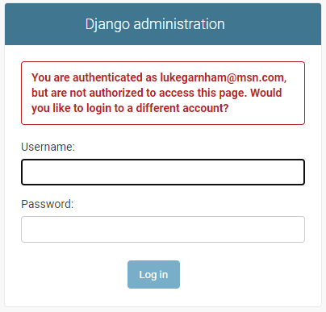
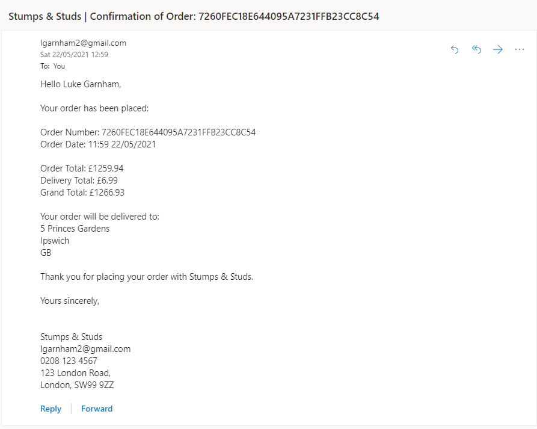
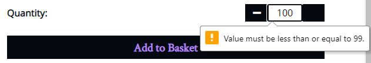
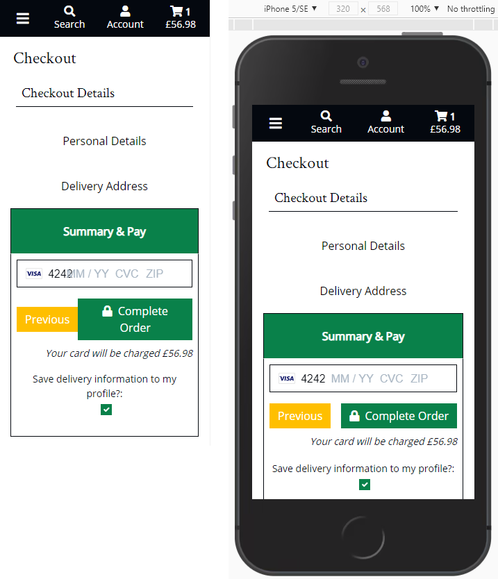
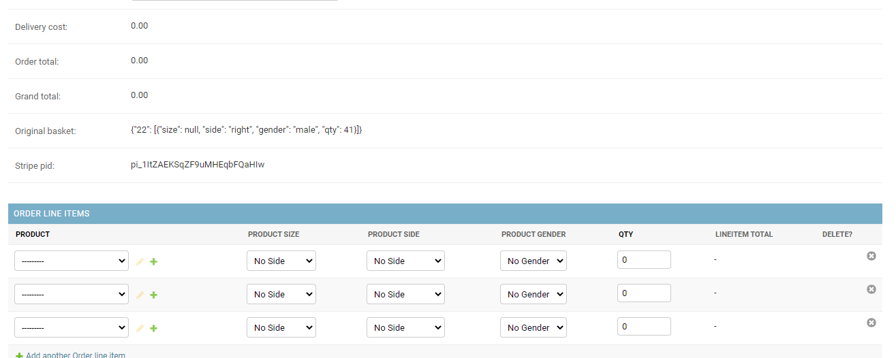
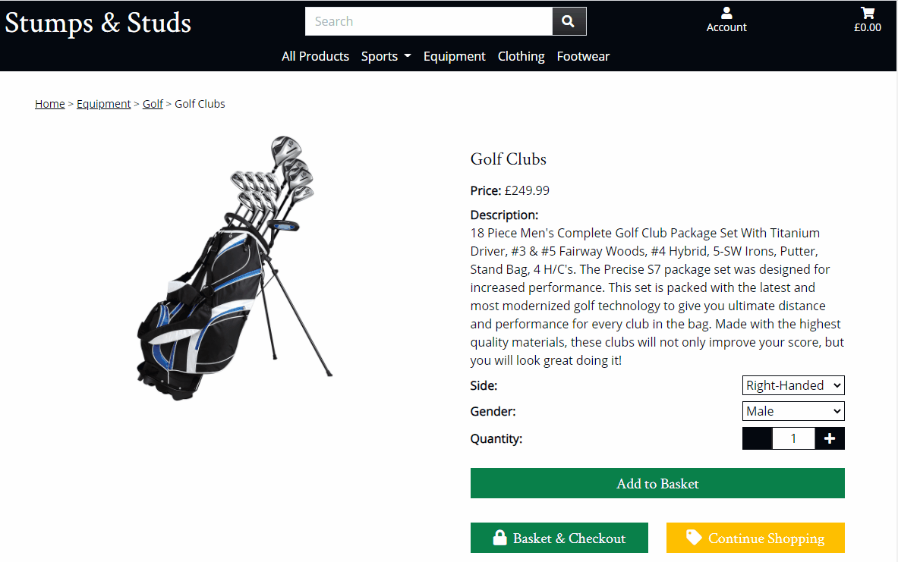
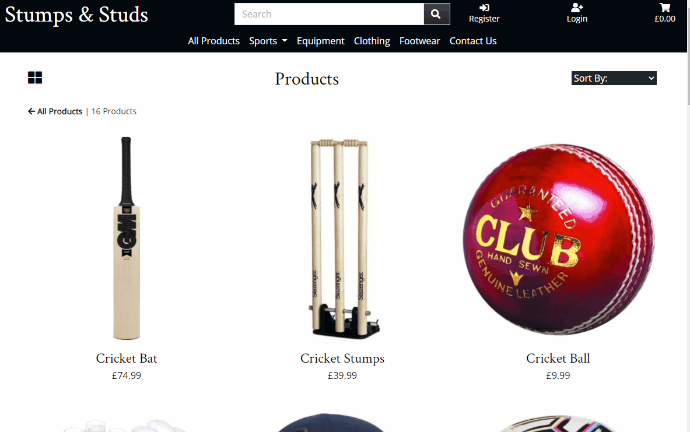
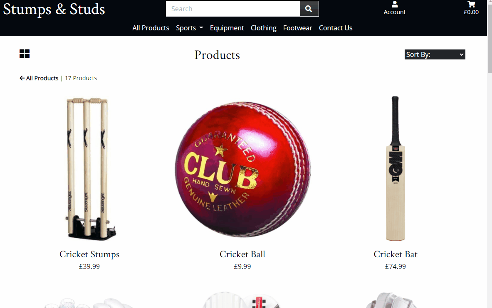

# Stumps and Studs

A fictional ecommerce website selling sports equipment and clothing.  Built using Django's Python framework.  Frontend developed using HTML, CSS & JavaScript with Bootstrap and jQuery libraries.  Backend built with Python (Django) utilising a Postrgres database.

## Demo

The final project is hosted on Heroku and can be found [here](https://stumps-and-studs.herokuapp.com/).

My GitHub repository can be found [here](https://github.com/LukeGarnham/Stumps-and-Studs-MS4).

## Contents

1. [**UX**](#ux)
    * [**Project Aim**](#project-aim)
    * [**User Stories**](#user-stories)
    * [**Design Decisions**](#design-decisions)
    * [**Wireframes**](#wireframes)

2. [**Code**](#code)
    * [**Settings**](#settings)
    * [**File Structure**](#file-structure)
    * [**Static Files**](#static-files)    

3. [**Database Schema**](#database-schema)
    * [**Data Scheme**](#data-scheme)

4. [**Features**](#features)
    * [**Existing Features**](#existing-features)
    * [**Features Left To Implement / Known Bugs**](#features-left-to-implement-/-known-bugs)

5. [**Languages**](#languages)

6. [**Technologies & Services Used**](#technologies-&-services-used)

7. [**Testing**](#testing)
    * [**Bugs Encountered During Development**](#bugs-encountered-during-development)
    * [**Testing Process**](#testing-process)
    * [**Bugs Encountered During Testing**](#bugs-encountered-during-testing)

8. [**Deployment**](#deployment)
    * [**GitPod Environment**](#gitPod-environment)
    * [**Packages Installed**](#packages-installed)
    * [**Create The Django Project**](#create-the-django-project)
    * [**Environment Variables**](#environment-variables)
    * [**Setting Up The Database**](#setting-up-the-database)
    * [**Create Admin Superuser**](#create-admin-superuser)
    * [**Deploy Application To Heroku**](#deploy-application-to-heroku)
    * [**Connecting Django Application To Postgres Database**](#connecting-django-application-to-postgres-database)
    * [**Creating An Amazon S3 Bucket**](#creating-an-amazon-s3-bucket)
    * [**Connecting To My Amazon S3 Bucket**](#connecting-to-my-amazon-s3-bucket)
    * [**Connecting To Gmail For Email**](#connecting-to-gmail-for-email)

9. [**Credits**](#credits)
    * [**Inspiration**](#inspiration)
    * [**Content**](#content)
    * [**Media**](#media)
    * [**Acknowledgements**](#acknowledgements)

## UX

[**Back to Contents**](#Contents)

### Project Aim

The aim of this project was to produce an enticing and fully-functioning e-commerce website.

### User Stories

* As a shopper/visitor to the website, I want to:
    -   Immediately understand the range of products the website sells.
    -   Easily navigate categories and search for products.
    -   View images of the products available to purchase.
    -	View the prices and details of each product.
    -	Select a size of product (where applicable).
    -	Select between right-handed and left-handed equipment (where applicable).
    -   Select between male or female version of a product (where applicable).
    -	Add multiple products to a basket.
    -	View items in my basket.
    -	Adjust the quantities of items in my product including removing them from the basket entirely.
    -	View the total cost of the items in my basket.
    -	View any delivery cost applicable.
    -	Easily navigate to a checkout page.
    -	Contact the company.

* As a shopper/visitor who has decided to purchase one or more products, I want to:
    -	Exit the checkout process and return to the store so I can amend the products in my basket.
    -	Be able to provide personal details such as name and email address.
    -	Provide a delivery address for my products to be shipped to.
    -	Enter payment card details to complete a secure checkout.
    -	View my order and the total cost of it including delivery throughout the checkout process.
    -	See a confirmation message confirming that the order has been placed.
    -	Receive an email confirmation that the order has been placed.

* As a shopper/visitor who intends to return to the website in future, I want to:
    -	Create an account.
    -	Store my personal and default delivery address details.
    -	Update my account details.
    -	View my past orders.
    -   Sign in and out of my account.

* As an administrator of the website, I want to be able to:
    -	Use the admin panel to add products.
    -	Use the admin panel to update the details of products.
    -	Use the admin panel to delete products.
    -	Use the admin panel to delete users.

### Design Decisions

#### Fonts

The fonts used throughout the website is Crimson Text for headers and Open Sans for all other elements.  I searched Google for some good font pairings for ecommerce websites.  I came across [this website](https://www.builderfly.com/7-perfect-font-pairing-for-your-ecommerce-website/) and was enticed by the pairing of Crimson Text and Source Sans Pro.  However, whilst I was developing the header and navbar, I decided that Source Sans Pro font wasn't quite right for my website.  I turned to [Google Fonts](https://fonts.google.com/) to identify other fonts which make good partners to Crimson Text.  I ended up choosing Open Sans as the font to partner Crimson Text.

#### Colour Scheme

I visited a number of popular ecommerce websites for inspiration in the colour palette and design.  [Asos.com](https://www.asos.com/men/), [Adidas](https://www.adidas.co.uk/), [New Look](https://www.newlook.com/uk/homepage) and also the [mini-project](https://mini-project-4-boutique-ado.herokuapp.com/) all demonstrate the simple use of predominantly black and white colour palettes with little colour used.  I think this helps ensure product images standout from the page and wanted to mirror this in my project.  I used [Coolors](https://coolors.co/) to help generate a colour scheme which incorporated a strong black but also other strong colours to help make certain sections and buttons of the website stand out.

#### Inspiration

I often find that ecommerce websites are very busy.  The amount of content visible on screen can detract focus away from the products.  For example, navigation bars, filters and product details (price, description, ratings, etc) all lead to a lot of text on screen at any one time while searching for products.  Although some product information is useful, product images, name and cost are the most essential things a user is looking for in my opinion.  Further product details can be accessed by clicking on a product and viewing all of its information so there is no need to show it all on the main navigation page.  When researching ecommerce websites for inspiration, I came across [this website](https://www.hardgraft.com/collections/footwear) which has a very stripped back layout, ensuring the product images take center stage.  This example really appealed to me.  For these reasons, I wanted to keep the real estate of the header and filters to a minimum and ensure the images were not cluttered with additional product information.

#### Home Page Images & Header

On the home page, I utilise jQuery to make the header transparent and remove the margin from the top of the body so that the images take center stage.  I ensured that the images I selected provide a good contrast for the white font color used on the header items.  Furthermore, I chose images which still looked good on screens with a smaller width.  Here is a comparison between the header on the home page (left) and how the header appears throughout the rest of the site on mobile:

On the home page, when the user starts scrolling down, the header remains at the top of the screen and the background returns to black so that the elements continue to stand out:

#### Navbar

Utilising jQuery, I added a feature which hides the navigation bar when users scroll down but makes it dropdown (reappear) as soon as they begin scrolling up.  This effect is only applied to medium screens upwards since on small screens, the navigation options are hidden (collapsed) behind the menu button and can be accessed by toggling this button.  As outlined above, I wanted to maximise the amount of space on screen for the products to take center stage.  I feel this solution offers good user experience since it means they do not need to scroll up to the very top of the page to access the navigation elements.

However, I did decide that there are some navigation elements which should always be visible to the user and hence I included them in the header which is fixed to the top of the screen throughout the website.  The navigation links I wanted visible at all times are the search form, basket, registration, login and account.  These all feature prominently in my user stories hence wanted to ensure visitors to my website can see them at all times and never have to hunt around for them.

#### Toasts

The toast success message includes a preview of the basket and a link to the basket page for users to quickly checkout.  I fixed the height of the toast basket and gave it the Bootstrap overflow-auto class.  This means users have a preview of their basket they can scroll through without too much screen real estate being used up.  I used Bootstrap's grid layout to make the basket preview responsive.  The success message is used to show users when an item has been added to their basket, a quantity amended or an item has been removed from their basket.

I decided that for warning, info and error messages, it was not necessary to show users the contents of their basket.  Furthermore, I also chose to only display the basket preview in the success toast to users when they are on a Product page.  When amending basket items from within the Checkout, there is no need to display a basket preview in the toast as it is already displayed in the Checkout page.  Elsewhere, success messages are generated when users update details related to their account and though they may have items in their basket, I decided it was not appropriate to show a preview within the toast.  Instead, the success messages displays according to the action they've successfully undertaken:

NB: In the GIF above, the cricket stumps have a size and gender.  These attributes were added to the product so I could test the messages and basket quantities updated as desired.  In the final project, cricket stumps do not have size or gender attributes.

### Wireframes

Prior to coding anything, I created wireframes for my prject using Balsamiq.  A PDF version of my wireframe can be found [here](media/readme/ms4-project-wireframe.pdf).

## Code

[**Back to Contents**](#Contents)

### Settings

The settings.py file is where the global settings for the project are configured.  Django creates a lot of these by default but there were some changes/additions which needed to be made as I developed the project.

*   **Installed Apps**:  For each new Django app I created, the app name needed to be added to the list of installed apps (INSTALLED_APPS).  Other apps such as Crispy Forms and Django Storages have also been added to the list so Django knows they are trusted apps which can be used.
*   **Django AllAuth**:  AllAuth can be configured in the global settings.py file.  Installation instructions for AllAuth can be found [here](https://django-allauth.readthedocs.io/en/latest/installation.html) and configuration instructions can be found [here](https://django-allauth.readthedocs.io/en/latest/configuration.html).
*   **Stripe**:  I followed the [Stripe documentatin](https://stripe.com/docs/payments/accept-a-payment) and the detailed [Code Institute Boutique Ado mini-project](https://learn.codeinstitute.net/courses/course-v1:CodeInstitute+FSF_102+Q1_2020/courseware/4201818c00aa4ba3a0dae243725f6e32/90cda137ebaa461894ba8c89cd83291a/) instructional videos to set up the payment system.  This is a test set up (rather than live) so cards will not actually be charged.  There are a variety of test payment card numbers provided in [Stripe's documentation](https://stripe.com/docs/testing#international-cards) which can be used to simulate a successful payment.  A Stripe public key (STRIPE_PUBLIC_KEY), Stripe secret key (STRIPE_SECRET_KEY) & Stripe webhook secret (STRIPE_WH_SECRET) are required to connect to Stripe but these are all stored as environment variables in both GitPod and Heroku as I don't want to share these publicly.
*   **AWS**:  I use Amazon Web Services (AWS) to host my static and media files for the deployed site (on Heroku) in an S3 bucket.  I have configured my global settings to enable my app to connect to it when deployed.  In Heroku, I have created a number of environment variables including USE_AWS which is set to True.  An 'if' statement in my global settings checks if this exists in the environment and if so, configures my app to use the AWS S3 bucket for static and media files.  I closely followed the videos in the Deployment section of the [Code Institute Boutique Ado mini-project](https://learn.codeinstitute.net/courses/course-v1:CodeInstitute+FSF_102+Q1_2020/courseware/4201818c00aa4ba3a0dae243725f6e32/d90bfac64e564b41a177b65c34a63502/) to set this configuration up - more detailed steps are explained in my [Deployment](#deployment) section below.
*   **Gmail Email Account**:  In order to actually send emails to users, I have configured the global settings to connect to my Gmail account.  The email address (EMAIL_HOST_USER) and Gmail app password (EMAIL_HOST_PASS) enable my app to connect to my Gmail account and these are set up as variables which are retireved from the Heroku environment so as to keep them private.  They are only required in the Heroku environment since I have configured the global settings to use the default Django email confifuration if in a development environment such as GitPod, otherwise the Gmail settings are used.

### File Structure

The project is split into apps.  Each app has files (such as forms, models, urls and html files) which are specific to that app.  However, there are some common files which we want apps to inherit from or which don't necessarily belong within one of the apps.  These are stored in the templates folder.

Each HTML file extends from the base.html file which is saved in the templates folder.  Toast templates are also stored within the templates folder.

The templates folder contains an 'allauth' subfolder which contains a number of the allauth template html files.  These were copied from the AllAuth site-packages directory using the following command before I then deleted the AllAuth openid and tests templates:

*cp -r ../.pip-modules/lib/python3.8/site-packages/allauth/templates/* ./templates/allauth*

I subsequently modified the base.html AllAuth template so that the style of my website is inherited through all of the AllAuth templates.  I further modified some of the individual AllAuth templates to ensure my desired styling on all pages.

### Static Files

I have an app (folder) called static which stores the base.css and base.js files as well as some media files for the home page and a loading gif which is used when the checkout form is submitted.

I could have created a static folder within each app and created a CSS and JavaScript file within it, specifically targetting each app.  For the CSS, I try to re-use rules and class names and thus found it easier to contain all of my custom CSS in the base.css file within the static app.  I have used comments to partition the base.css file so that I can easily identify rules which are specific to each app.  Whilst I could have split this out across multiple lines, it was my personal preference not to do this.

However, for the JavaScript I found it easier to partition this between each app.  There are a couple of ways I have done this; sometimes I have included a script within html files which extends the postload_js block from the base HTML template whilst in other apps, I have created a static folder within the app containing JavaScript files.

For example, I wrote some custom JavaScript in the basket app to allow users to update quantities or remove items from their basket.  This is included in the postload_js block within the basket.html file.  However, for the checkout app, there is custom JavaScript to control the checkout form buttons (which enables users to click through the various tabs) and to process the Stripe elements of the form.  Since there is a considerable amount of JavaScript, I opted to include this in two files housed within a static folder in the checkout app.

All static folders are collected (by collectstatic) when the project is pushed to Heroku and they are stored in my AWS S3 bucket in the deployed version.

## Database Schema

[**Back to Contents**](#Contents)

### Data Scheme

#### Basket Variable in Session Memory

The products my website sells includes sports equipment and clothing.  Clothing items typically have sizes and there are some sports equipment which are specific to male or female.  Furthermore, some equipment is taylored for either right-handed or left-handed users; golf clubs for example.  As such, the products in my database have 3 booleans properties; has_sizes, has_side, has_gender.  These indicate whether or not that product has that attribute.  The attributes determine the options users have on the product details page when shopping for products.  Products can have none of these attributes, some of them or all of them.

The items a user adds to their basket need to retain the properties they have selected.  To do this, I needed to come up with a structure for storing basket items within a variable called basket which is saved in session memory.  The basket variable is a dictionary where the keys are the unique product ID's.  For items without any attributes, the value is simply the quantity that the user has added to their basket {product_id: quantity}.

For items which do have at least one of the three aforementioned attributes (size, side, gender), a different structure is needed.  Since each item a user adds of the same product could have different attributes and be of varying quantities, I opted to store all of these attributes within a dictionary which in turn is within a list.  This list is the value to the product ID key in the basket dictionary: {product_id: [{'size': size, 'side': side, 'gender': gender, 'quantity': quantity},]}.

When adding these attributes to the dictionary, I don't distinguish between products which only have some of these attributes and those which have all.  If a product doesn't have one of the 3 attributes, I asign it the None object.

When adjusting the basket or removing an item, I cycle through the list of dictionary's and check whether the size, side and gender in the dictionary match what the user has submitted and update the quantity or remove the dictionary accordingly.

The view.py file in the bag app contain functions for managing the basket variable; add_to_basket, adjust_basket, remove_from_basket.

The size options users can select from are:
* Junior (jr)
* Extra Small (xs)
* Small (s)
* Medium (m)
* Large (l)
* Extra Large (xl)

The side options users can select from are:
* Right-Handed (right)
* Left-Handed (left)

The gender options users can select from are:
* Male (male)
* Female (female)

#### Contexts

Within the basket app, there is a contexts.py file which is added to the list of context_processors within the global settings.  This makes the variables within it available throughout my website.  Within it, I create variables for the total cost of the items in the basket (total), total number of items in the basket (product_count), cost of delivery (delivery) and the total cost of the items in the basket plus delivery (grand_total).  There is also a list (basket_items) of products which uses the basket variable in session memory to unpack details of the products the user has added to their basket.

The basket_items varable stores the unique product id, the product object from the Products model and a details list.  The details list consists of dictionary's.  If the product has at least one of the size, side or gender attributes, the dictionaries will contain all of these attributes.  If the product doesn't have any of these attributes, the details list will only have one dictionary which will be the quantity.

So for products with no size, side or gender, the structure in the basket_items list is:

{'item_id': product_id, 'product': Product(object), 'details': [{'qty': quantity}]}

For products which have at least one attribute (either size, side, gender),  the structure in the basket_items list is:

{'item_id': product_id, 'product': Product(object), 'details': [{'qty': quantity, 'size': size, 'side': side, 'gender': gender}]}

The data structure allows for product details, quanities and where applicable, attributes to be unpacked in the basket page using Jinja.

## Features

[**Back to Contents**](#Contents)

### Existing Features

- Admin:  There are two levels of users for my website; superusers and active (standard) users.  Superusers are administrators for the site who have access to the Django Admin panel.  Superusers can access this from the Account dropdown in the header through a link labelled Site Admin but this will not be visible for active users (or anyone who is not logged in to an account).  From the Admin panel, superusers can:
    - Add new Products, amend or delete existing Products.
    - Amend the status of other users and/or delete them.
    - Verify and/or delete email addresses.
    - View all orders as well as delete them or modify them including amending or removing items and adjusting quantities.
    - View and delete messages (submitted via the contact app).
    - View, amend and/or delete User Profiles.

- Search:  In the Header, there is a search form which allows users to search for items my Stumps & Studs business sells.  The search returns any products which contain the search string in either the product name or description.  For example, entering 'bat' in the search form will return 4 results including Cricket Pads since they contain the phrase 'Batting Pads' within their description, and the Football Pump because its description contains the word 'batteries':

- Stripe:  I have used Stripe to implement a payment processor so users can complete a checkout process.  I have not implemented a live payment system, only a test one meaning cards will not be charged.  To mimic a successful payment, users can enter any of the [Stripe test card numbers](https://stripe.com/docs/testing#international-cards) - the card number for the UK is 4000008260000000.  The expiration date can be any future date while the CVC and postcode can be anything.

- Stripe Webhook:  A Stripe webhook handler has been developed so that if the checkout process is interrupted for any reason, situations where a users payment is processed but their order isn't placed are avoided.  When a successful payment is received by Stripe, a webhook is sent.  I capture this and check the Orders model to see if the order is stored there, in which case the order was placed before any interruption.  If the order is not in the Orders model, this means successful payment was received by Stripe but then an interruption prevented the order from being added to the Orders model.  Fortunately, the Stripe webhook provides details of the order meaning in these such scenarios, the order can still be added to the Orders model.

- My Account:  Logged in users can access My Account through the Account dropdown in the header.  In the Account page, users can view their default delivery address and phone number, view previous (historic) orders and also reset their password.

- Contact Us:  Users can contact Stumps and Studs by completing a form.  The email address the user provides then receives an automatic email notification confirming that the message has been received.  This notification includes a copy of the message.  For an actual business case, I would configure this so that the company mailbox (e.g. contactus@stumpsandstuds.com) also receive a copy of the message via email which would enable a member of staff to then reply to the customer (user).

### Features Left To Implement / Known Bugs

- I would like to add more products to the project, for example there is a limited amount of footwear and clothing.  I would also like to add items of clothing which are spefically for male or female customers.
- If I were to add items which were just for males or females, I would add another field into the Products model called gender, which for items which have a gender, there is a choice of male, female or both.  A womens t-shirt would have the value of female however golf clubs which can be male or female would have the value of both.  In the frontend, I would then like to enable users to filter products by gender.  I would have a drop down on the navigation bar where users can select male or female and return any products which are specific to that gender plus any that can be either (e.g golf clubs).
- Products with sizes allow users to select from Junior, Extra Small, Small, Medium, Large or Extra Large.  While this is fine for most items of clothing, sizes for footwear are numbered.  A future development would be to add different sizing options for footwear.
- Another future development would be to add a stock count field to the Product model.  In a real-world scenario, a business would want to prevent customers from ordering products when they are out of stock and possibly warn users when stock is low.  Each time an item is bought, the stock count would need to be reduced by the quantity, factoring in the size, side and/or gender accordingly.  Once the stock count is 0, I would then either prevent the product appearing in the frontend or amend the display so users can see it is out of stock and prevent them from adding it to their basket.
- Another feature I didn't have time to implement is to give users the option to subscribe to a mailing list.  Many businesses wish to frequently contact customers with marketing emails so this would be a useful feature.
- One bug I encountered and haven't had time to resolve is on the Products page.  On large screens, the products are laid out in 3 columns by default but users have the option to switch to 2 columns wide - this makes the images larger.  However, whenever the user refreshes the page or uses the Sort By dropdown, the page reverts back to the default layout.
- On small and medium screens, the navbar and search form both appear as dropdowns which users can toggle with buttons on the header.  These both reveal smoothly.  However, the dropdow menu for the Account, Sports and Sort By (on the Products page) all just appear with no smooth visual effect.  Given more time, I would have explored ways to make these have the same effect as the navbar and search form.
- On the Products page, the Sort By dropdown has a different hover effect than the Account and Sports dropdown.  The dropdowns on the Product Details pages also have this same problem.  This is a because both utilise a *select* input with *options* which cannot be styled in CSS.  There may be a solution which utilises JavaScript but given the deadline for this project, I was not able to explore it.
- On the Product Details page, I would have liked to have the dropdowns start with 'Please Select' rather than a default selection such as Medium for size.
- On the Home page on small and medium screens, the header is transparent when scrolled to the top of the page.  I implemented a JavScript solution so that when the user clicks the menu buttom and the navbar is revealed, the header loses it's transparency and then gains it again when they close the menu bar.  However, if the user scrolls down the page, then clicks the navbar to reveal the menu and then scrolls to the top of the page (with the navbar still expanded), the header regains its transparency.  This is something else I ran out of time to fix:

- In my project, administrators (superusers) can update the Products model through the admin panel.  Given more time, I would have liked to enable superusers to have full CRUD functionality over the Product models through the frontend.
- On the Contact page, I wanted to utilise an API to show the a location for Stumps & Studs head office.  I would have added this if I had more time before my deadline.
- The navbar contains links to each of the 3 categories (equipment, clothing, footwear).  Similarly, the various sports are listed in a dropdown on the navbar too.  The Categories and Sports models appear in the admin panel so superusers can add more if they wish to do so.  However, any more that are added in the admin panel do not automatically get created in the navbar - they would need to manually be added.  A future development would be to explore ways in which I could pull the data from the Categories and Sports models and then inject the results into the navbar to create a dynamic navbar which updates automatically.  For example, if a superuser adds Basketball as a sport in the Sports model, this gets added automatically into the sports dropdown list in the navbar.
- The Contact page contains a form allowing users to submit a message.  This is confiugured using the Django TextField class.  There are no validation rules applied to this field meaning users can enter any string of characters (letters, numbers, special characters).  Whilst the form functions as desired, there could be a security vulnerability here - my mentor mentioned somthing called SQL injection whereby data from databases is extracted by malicious users sending a SQL command into the database.  Without knowing too much about this, one solution would be to prevent certain special characters from being used, possibly limiting the input to only letters, numbers and full stops.  I ran out of time to explore this properly but there are some methods in the [Django documentation](https://docs.djangoproject.com/en/3.2/ref/validators/).
- The Checkout form is split into 3 fieldsets with each one on a tab of its own.  This enables users to enter each section of information separately.  If the information they enter into any field is invalid (such as an email address containing special characters like asdasds@@!"£"$".com), there is frontend validation which prevents the form from being submitted.  However, if this error occurs on either the Personal Details or Delivery Address tabs, the frontend validation error message is not visible.  The user cannot submit the form but there is no visible message explaining why.  There may be a solution in JavaScript to ensure that these messages are visible or alternatively, I could change the layout to remove the tabbed layout and instead have all fields visible on the page at one time.  I ran out of time to explore these solutions possible solutions.
- On the checkout form, the phone number field allows users to enter letters and special characters as well as numbers.  Ideally this would only allow numbers to be entered so this is another future improvement I would make given more time.

## Languages

[**Back to Contents**](#Contents)

* HTML
* CSS
* JavaScript
* Python

## Technologies & Services Used

[**Back to Contents**](#Contents)

 - [Django](https://www.djangoproject.com/)
 - [Bootstrap5](https://getbootstrap.com/)
 - [jQuery](https://jquery.com/)
 - [Django AllAuth](https://django-allauth.readthedocs.io/en/latest/)
 - [Pillow](https://pillow.readthedocs.io/en/stable/index.html)
 - [Crispy Forms for Bootstrap5](https://github.com/django-crispy-forms/crispy-bootstrap5)
 - [Django Countries](https://pypi.org/project/django-countries/)
 - [DJ Database URL](https://pypi.org/project/dj-database-url/)
 - [Psycopg2](https://pypi.org/project/psycopg2-binary/)
 - [Gunicorn](https://pypi.org/project/gunicorn/)
 - [Boto3](https://pypi.org/project/boto3/)
 - [Django Storages](https://pypi.org/project/django-storages/)
 - [Heroku](https://heroku.com/)
 - [Postgresql](https://www.postgresql.org/)
 - [Gmail](https://mail.google.com/mail/)

## Testing

[**Back to Contents**](#Contents)

### Bugs Encountered During Development

#### Search Placement

Whilst building the header and navbar, I wanted the search box to be appear and disapear via a toggle button.  However, I only wanted this to apply to small screens; on medium screens (768px) upwards, I wanted the search box to remain visible in the header.  I initially tried to achieve this with jQuery applying jQuery UI effects to achieve a smooth dropdown transition.  The problem I encountered here was getting the search box to not be visible by default on small screens but always be visible on large screens.

I added the classes "d-none" and "d-md-block" to the #nav-search element.  This ensure that the elements initial state was correct.  However, getting jQuery to override the "d-none" class on small screens was a challenge.  I tried chaining toggle effects with toggling classes too to add/remove the "d-none" class.  However, this meant the transition was not smooth; the element would show after the effect had been applied or be hidden before the effect had been applied.

I ended up utilising [Bootstrap's collapse](https://getbootstrap.com/docs/5.0/components/collapse/) component to reach a solution.  Applying the "collapse" class to the #nav-search meant I could control have it hidden by default but toggle it's visibility using the #search-button element in the header.  I changed the #search-button to a button rather than a div to ensure semantic rules were followed and then applied some Bootstrap classes and custom CSS to achieve the desired styling.  Finally, I after the "collapse" class, I added the class "d-md-block" to the #nav-search element.  The reason for this is to ensure that it is always visible on medium screens upwards.  Whilst the visibility of this can still be toggled by the #search-button, this element is hidden on medium screens upwards so it cannot be clicked.

#### Header Account Button Position on +Medium Screens

On medium screens upwards, the header contains a Stumps and Studs anchor link, the search bar and links to enable users to login, logout, access their account page and view their basket.  I wanted to keep the basket visible always in the top-right corner of the header.  The other links between the search bar and basket link vary depending on whether a user is logged in or not.  When the user is not logged in, there are 3 links; Register, Login and the Basket.  I want to entice users to either register for an account or login so opted to have these visible in the header at all time.  When the user is logged in, there are 2 links; Account and Basket.  The Account link is actually a dropdown which has two links; one for My Account and one for Logout.  I could have had these as two separate links but I don't want the Logout link to be visible as I don't want to entice users to logout.  Below is a screenshot showing the header including the navbar on medium screens, firstly when a user is logged in and then when a user is **not** logged in:

The container for the links is a flex box utilising [Bootstrap's flex classes](https://getbootstrap.com/docs/5.0/utilities/flex/#justify-content).  I use the class 'justify-content-between' to space the links out.  When they are logged out, the 3 links are evenly spread out but when users are logged in, I felt that the Account link was spaced too closely to the search bar.  I considered adding some margin to the left of the Account link but this didn't create the desired effect.  I wanted to center the Account link between the search bar and Basket link.  The simple solution I utilised was to create an empty list item before the Account link which means the flex box evenly spaces 3 elements out thus pushing the Account link into the center.  To ensure the layout on small screens isn't effected, I used Bootstrap classes 'd-none d-md-block' to ensure it doesn't displace any links on small screens.  The end result is below with the change being seen in the header when users are logged:

#### Navbar JavaScript

On medium screens upwards, the navbar sits below the header whilst on small screens, it is shown/hidden using the menu button in the header.  On medium screens, I wanted the navbar to disappear when users scrolled down and then reappear when they scroll up.  The reason I wanted to do this was to preserve real estate space on screen.  To help achieve this, I referenced a solution on [w3schools.com](https://www.w3schools.com/howto/howto_js_navbar_hide_scroll.asp).

However, since I only wanted to apply this effect on medium screens upwards, I check the screen width.  If the screen width is greater than or equal to 768px, the effects are applied depending on the direction of scrolling.  However, when I tested the result of this effect, I noticed a bug.  When scrolling down on a medium screen, the navbar is hidden.  If the user then changes the screen size to a small screen, the navbar remains hidden and can no longer be toggled by the menu button:

To resolve this, I searched Google and found another function I could use to resolve the problem.  Since this unique bug only occurs when the user changes the screen width, I created a function which is called every time the screen is resized.  I read up about the resize() method on [w3schools.com](https://www.w3schools.com/jquery/event_resize.asp).  When the screen is resized, I check the screen width again and if it is less than 768px, I show the navbar.  This means it can be toggled by the menu button as desired:

#### Remove from Basket

To remove items from the basket in the Basket page, JavaScript is utilised to post data and remove an item from the basket.  Using if statements, hidden data is included in the post data for the items size, side and gender as applicable.  The remove_from_basket function in the bag app views.py file is called to handle the request.  Within the function, I check whether any size, side or gender has been provided.  If not, I remove (pop) the item from the basket variable stored in session memory.  If it does have any one of these variables, then the product must have details so the value in the basket dictionary will be a list.

I cycle through the list of dictionary's and search for the item with the corresponding details to delete.  To achieve this, I check each dictionary to compare the size, side and gender variables.  When I find a match for all 3, I remove the dictionary from the list.  The issue I encountered when building this function is that where there is no such variable, rather than the None object being passed to the function and None string is passed.

As an example, if I had cricket gloves in my basket which have a size and side but no gender, the size and side passed to the remove_from_basket function were correct but the gender was a None string.  When cycling through the dictionary's in the basket, any cricket gloves in there will have a size and side but the gender is a None object.

When comparing each detail to check for a match, I never achieved one since the gender None string is not equal to the gender None object in the basket.  To overcome this, I inserted a series of if statements at the start of the function.  Once the size, side and gender variables have been retrieved from the request, I check each of them in turn to see whether any of them are equal to a None string (e.g. if size == 'None':), and if so, make the variable equal to the None object (size = None).  This meant that when checking the dictionarys for an item which matched the one the user is trying to delete, a match was found and the dictionary could then be removed.

Finally, to ensure that no empty lists are left in the basket, I check see if there are any of that product left in the basket and if not (e.g. the list is empty), I remove it from basket.

#### Toasts - Positioning

When creating the toast messages, I decided I wanted them to appear beneath the header but with a fixed position on top of existing content.  To achieve this, I gave the toast box a fixed position and z-index of 9999999 to ensure it overlays all other content.  Setting the position relative to the top of the page was a little tricky though.  The header height varies; on small and medium screens it is 53 pixels while on larger screens it varies between 53 pixels and 93 pixels depending on if the navbar is visible.  By setting the position to the top at 93 pixels, there would occasionally be white space between the header and the toast which I don't think looks very good:

To resolve this, I utilised jQuery and CSS.  Within my base.css file, I set the toast position to 93 pixels from the top but used a media query to reduce this to 53 pixels on screen sizes up to 768px wide.  Then, using the jQuery functions I created to hide and show the navbar on large screens, I add and remove a class to the toasts called 'toast-up' which changes the position to the top of the page to 53 pixels.  By setting the same transition speed to the navbar hide/show and the toast add/remove class, the toasts move up and down in line with the navbar on large screens but sit under the header on small and medium screens:

#### Toasts - Display Basket Preview

As mentioned above in the Design Decisions section, I opted to only display the basket preview in the success toasts but only when the user is on a Products page.  To achieve this, I added a new variable to the product views context called 'toast_basket_preview' which is set to True.  Then within the toast_success.html file, I added a Jinja if statement which checks to see if this variable is true and whether there are any items in the basket.  If this criteria is satisfied, then the basket preview displays in the toast success message.  Otherwise, only the message appears and the basket preview does not.

If I choose to include the basket preview on other pages in future, it is quite a simple solution.  All that needs to be done is pass the 'toast_basket_preview' variable to the context and set its value to True.

#### Order Grand Total

As I develpoed the checkout models, I stumbled upon an issue with the format of my order total (order_total) and the delivery total (delivery_cost).  The order total is the sum of all of the order items multiplied by the corresponding quantities.  It uses the Django DecimalField to store the value as a decimal.  The delivery cost comes from the global settings but is a float with value 6.99.  When adding the two values together to get the grand total (grand_total), I received the below error caused by trying to add two variables of different type together:

To overcome this, I turned to Google and found a [simple solution](https://stackoverflow.com/questions/316238/python-float-to-decimal-conversion).  I decided to convert the delivery cost variable into a decimal.  To achieve this, I simply imported the Decimal function (from decimal import Decimal) and passed the delivery cost variable into it.  Doing some further reading, I discovered that simply converting a float to decimal often introduces a rounding error.  Whilst the grand total is stored as decimal too with 2 decimal places so any rounding errors shouldn't cause an issue, I read that best practice is to convert the variable to a string before converting it to decimal.  Using the print function, I compared the outputs when converting the delivery cost to decimal:

6.9900000000000002131628207280300557613372802734375

When converting the delivery cost to a string and then a decimal this was the output:

6.99

I decided it was best practice to convert the delivery cost to a string and and then a decimal.  With the delivery cost now the same variable type as the total cost, both decimal, I was able to successfully add the two variables together.

#### Checkout Form Next/Prev Buttons

In the Checkout page, I created tabs using [Bootstrap](https://getbootstrap.com/docs/5.0/components/navs-tabs/#javascript-behavior) so that users can enter personal, delivery and payment details on separate tabs.  I used JavaScript to enable functionality so users can click either the tabs or previous/next buttons to navigate through each step of the process.  This is housed in checkout_form_buttons.js within the static folder in the checkout app.  I prevent users from moving onto the next step unless there is a value in all required fields.  Originally, I created functions which were triggered when there is any input on a required field.  After I completed the profiles app, I noticed a bug with this.

The profile app allows users to save the default delivery information which the checkout app can retrieve and pre-populate the form with.  This meant that the checkout app could be loaded with all of the required fields in the delivery tab already populated.  Since the next button on the delivery tab and 'Summary & Pay' tab are both disabled by default when the page loads, users cannot move onto the final tab unless they input something (i.e. change the default value) in one of the required fields:

To resolve this issue, I modified the JavaScript so that when a user clicks either the next button or a tab header, not only does that tab become active but I also check the required fields on it.  This means that if the required fields in the tab arrived at are already populated, the next button and next tab header both get enabled.  So in the specific bug, when a user has populated the 3 required fields in the 'Personal Details' tab and they then click either the Next button or 'Delivery Details' tab, the required fields on the 'Delivery Details' section are immediately checked and the Next button and the 'Summary & Pay' tab are both enabled, thus improving the user experience:

#### Checkout Success

On the checkout success page, the product details (side, size and gender) all appeared as the value entered into the basket when a user adds a product in the product details page.  For example, the sides were left or right, rather than left-handed or right-handed.  Furthermore, in the admin panel, these 3 detail fields were free text fields meaning a user with access to the admin panel could enter any value.

To overcome this, I changed the product_size, product_side and product_gender in the OrderLineItem models within the checkout models.py file.  I changed these fields from Charfields with a maximum length of characters to fields with choices referring to the [Django documentation](https://docs.djangoproject.com/en/3.2/ref/models/fields/#choices).  After making the migrations, when adding a line item to an order from within the admin panel, users are now restricted to only select from the choices defined:

One drawback with this approach is that not all products have sizes, sides or gender but these inputs are not restricted in the admin model.  For example, an admin user could apply a gender of male to a product which doesn't have this attribute such as a cricket ball.

Secondly, I used the get_FOO_display method to display the 'human-readable' value of the choices field - again I reffered to the [Django document](https://docs.djangoproject.com/en/3.2/ref/models/instances/#django.db.models.Model.get_FOO_display) for a solution.  Here is the checkout success page before and then after these changes were made:

#### Basket Quantity

The quantity of each item can be increased or decreased from the Basket page through increment and decrement buttons.  The behaviour and functionality is controlled using JavaScript, specifically the qty_input_script.html file within the includes folder in the products app (this script also provides the same functionality in the Product page).  The bug I encountered on this page was that the disable and increment buttons would only be enabled/disabled as expected on the first item of a product type.  In the screenshot below, there are multiple Cricket Stump items and multiple Batting Glove items within the basket.  There is 1 of each item meaning the decrement button should be disabled.  This is only the case for the first instance of each product:

Upon closer inspection, I identified that the cause of the issue was the id of each quantity input (with class .qty_input).  The id was *id_qty_* followed by the product id number.  This meant that where multiple items for the same product were in the basket, there would be multiple inputs with the same id.  Since the JavaScript utilised the id to target the element and enable/disable the decrement and increment buttons, only the first instance had the proper functionality applied, hence the result in the above screenshot.  Since the Products page only have only product on them, this wasn't an issue on that page but in the Basket page, this needed addressing.

To resolve this, I needed to make the id of each input element unique.  Since each item it displayed to the Basket page using a Jinja for loop, I found a [solution online](https://stackoverflow.com/questions/35343881/jinja-loop-index-does-not-print) which enabled me to easily add the loops iteration number to the end of the id such that each one is now unique (*id_qty_{{ item.item_id }}_{{ forloop.counter }}*).  I needed to amend the data-item_id attribute of the input.  Having made these changes to the input, I replicated them on the decrement and increment button to ensure each had a unique id and the correct element is targetted by JavaScript.  This enabled me to get the desired end result:

### Testing Process

At the time of writing, I am about to start testing my project. Here are the manual test procedures to assess functionality, usability, responsiveness and data management that I plan to undertake:

 - [**Links**](#links): Test all links and buttons in each webpage to ensure that they direct the user as expected.
 - [**Access To Pages**](#access-to-pages): Can users access pages they're supposed to and prevented from accessing pages they're not supposed to access depending on whether they are signed in or not.
 - [**Test User Stories**](#test-user-stories): Test each of my user stories i.e. does my finished project enable users to achieve what I set out for them to achieve?
 - [**Forms**](#forms): Do forms behave as desired? Is data validated before being passed to the database? Is defensive design sufficient?
 - [**Checkout Form**](#checkout-form): Does this behave as expected?  Is there a way to bipass the checkout to complete an order?  Are orders successfully created if the checkout process is interrupted?
 - [**Login & Logout**](#login-&-logout):  Can users log in and out of their account?  Can users register for a new account?  Can users retrieve their forgotten passwords and change existing passwords?  Does AllAuth manage the entire account handling as expected/desired?
 - [**Responsive Design**](#responsive-design):  Does each page function well on all screen sizes?  Are layouts adjusted according to maintain strong UX design across all screen sizes?
 - [**Valid Code**](#valid-code): I will run my code through validators to check for any issues.
 - [**Google Lighthouse Tool**](#google-lighthouse-tool): I will use the Google Lighthouse tool to check for any improvements that can be made.

All tests will be conducted on the deployed version of the website hosted by Heroku rather than within the GitHub environment. This is because the final deployed site is what users will see and so it is important to ensure the behaviour of this is as desired.

I will attempt to test each section using an 'Aim, Methodology, Result' process.  I will explain what my aim is, how I am testing it and the results I get so that others can perform the same test and can expect to receive the same results.  I will detail any bugs I discover and explain corrective action taken or reasons why the bug has not been fixed.

#### Links

Aim:  I will test all links on each page throughout my website to ensure they all work and direct users to the correct page.  I also need to ensure that links which direct users to external websites open in a new window.

Methodology:  I will test the links in the header and footer since these are inherited by every page from the base.html file.  In the header, I will test the links on small-medium screen sizes and +large screen sizes and also as a logged in user and non-logged in user since the header links will change depending on the screen size and logged in status.  The toasts only have one link; the success toast has a link to the basket page which I will test.  I will then test the links on the body of each page to ensure they all work as expected.

Results:

 - **Header**:  All links work correctly across the various screen sizes and whether users are logged in or not.
 - **Footer**:  All links work correctly.  The social media links correctly open in a new window.
 - **Toasts**:  The link in the success toast correctly directs users to the basket page.
 - **Home**:  There are 4 links, one on each carousel which open the Products page but with various filters applied.  All work correctly.
 - **Products**: I first tested the Sort By button where I discovered a bug which I was able to resolve.  I have explained this in the [Bugs Encountered During Testing](#sort-by-on-the-products-page) section below.  Each product is a link to it's Product Details page and they work correctly.
 - **Product Details**:  All links work as expected.
 - **Basket**:  The buttons to update quantities or remove items from the basket work as expected.  The links to the Checkout and Product page both work.  Each product image and product name are also links, both directing users back the Product Details page - they both work correctly.
 - **Checkout**:  The tabs on the checkout form and the next buttons are disabled unless there is a value in each required form field in that fieldset.  These all work as expected.  One thing to note is that the Complete Order button is disabled until the required card details for has a value - the button is enabled as soon as any value is entered into the card details field.  Stripe handles the validation of the card details, the enabling of the Complete Order button is only dependent on a value being entered and not whether the value entered is valid.
 - **Checkout Success**:  There are two links on this page but only one is visible depending on whether the user has reached the page having completed the checkout form (process) or if they're viewing a previous order from the Account page.  If they've completed the checkout process, the button will be to direct them back to the Products page - this works correctly.  If they are viewing a historic order, the button returns them back to their Account page - this link works correctly too.
 - **Account**:  The Update button successfully saves the default delivery information field.  The Change Password form correctly directs users to an AllAuth template to change their password.  In the order history section, the order number is a link which takes users to the Checkout Success - this works correctly.
 - **Contact Us**:  The Send Message button successfully submits the contact form.  The email address link has the correct href so that a blank email is opened in the default email application (e.g. Outlook).  Similarly, the phone number link opens a phone call in the devices default application.

#### Access To Pages

Aim:  I must ensure users cannot access pages they are not authorised to access including viewing other users account and/or order details.

Methodology:  I will test each of these scenarios which could see a user access a page they should be able to.  Users should not be able to:
 - Navigate to the Checkout page while having no items in the basket.
 - Navigate to the Account while not logged in.  I will copy the URL when logged in, then log out and then copy and paste the URL to ensure I am not directed to the Account page.
 - Navigate to the Log Out while not logged in.  I will copy the URL when logged in, then log out and then copy and paste the URL to ensure I am not directed to the Log Out page.
 - Navigate to the Log In page while already logged in.  I will copy the URL when logged out, then log in and then copy and paste the URL to ensure I am not directed to the Log In page.
 - Navigate to the admin panel when not logged in as a superuser.

Results:

 - If there are no items in the basket, users are unable to access the Checkout page.  Instead they are redirected to the Products page and an error message (toast) is presented explaining that 'There's nothing in your basket at the moment'.
 - When trying to access the Account page when not logged in, users are redirected to the Login page.  The link to the Account page sits in the Account dropdown in the header - this link is not visible to users who are not logged in.
 - When not logged in, users cannot access the Log In page.  Instead they are redirected to the Home page.
 - When already logged in, users cannot access the Log In page.  They are instead redirected to the Home page.
 - If users are not logged in, they can manually enter the URL for the admin panel but will see the admin login page so they cannot reach the admin panel.  If a user is logged in but is not a superuser, they will also see the admin login page along with a message advising them they are not authenticated to access the page:

 

NB:  Users are able to navigate to the Checkout Success page for an order that isn't theirs.  Using the order number, anyone can access the Checkout Success page to view the order details.  Since users do not need to be signed in to place an order, there is no authorisation required to access this page.  However, in order to view someone else's order, the 32 long aphanumeric order number is required.  This is sent to the email address provided when a user completes the checkout process so unless they pass this on to someone else, no one is likely to view the order but them.  Order numbers are not sequential.  Guessing a 32 character string which matches an order number in the Orders models is extremely unlikely.  If this was done, the order cannot be modified through the Checkout Success page though address details are visible which could constitute a breach of GDPR.  One future change I could make is to only show the delivery address details if the user is logged in and the order belongs to them and if not, only show them the ordered items without any personal or delivery information.

#### Test User Stories

Aim:  Assess each of the user stories to ensure that my project delivers on them all.

Methodology:  I will test each of the user stories in turn.  I will ensure that users are able to complete each story I set out at the start of this project.  The user stories are numbered below and I will refer to the numbers in the Results section beneath them where I explain how each is fulfilled:

 1  As a shopper/visitor to the website, I want to:
 a) Immediately understand the range of products the website sells.
 b) Easily navigate categories and search for products.
 c) View images of the products available to purchase.
 d)	View the prices and details of each product.
 e)	Select a size of product (where applicable).
 f)	Select between right-handed and left-handed equipment (where applicable).
 g)	Select between male or female version of a product (where applicable).
 h)	Add multiple products to a basket.
 i)	View items in my basket.
 j)	Adjust the quantities of items in my product including removing them from the basket entirely.
 k)	View the total cost of the items in my basket.
 l)	View any delivery cost applicable.
 m)	Easily navigate to a checkout page.
 n) Contact the company.

 2  As a shopper/visitor who has decided to purchase one or more products, I want to:
 a)	Exit the checkout process and return to the store so I can amend the products in my basket.
 b)	Be able to provide personal details such as name and email address.
 c)	Provide a delivery address for my products to be shipped to.
 d)	Enter payment card details to complete a secure checkout.
 e)	View my order and the total cost of it including delivery throughout the checkout process.
 f)	See a confirmation message confirming that the order has been placed.
 g)	Receive an email confirmation that the order has been placed.

 3  As a shopper/visitor who intends to return to the website in future, I want to:
 a)	Create an account.
 b)	Store my personal and default delivery address details.
 c)	Update my account details.
 d)	View my past orders.
 e) Sign in and out of my account.

 4  As an administrator of the website, I want to be able to:
 a)	Use the admin panel to add products.
 b)	Use the admin panel to update the details of products.
 c)	Use the admin panel to delete products.
 d)	Use the admin panel to delete users.

Results:

 1a) On my Home page, there is a Shop Now button front and center so users know immediately that the website has products to sell.  I have a carousel containing pictures of sports equipment, clothing and footwear along with links to the products for sale and descriptions of each so users can quickly learn about the range of products available on my site.  The carousel automatically cycles through each image but users can cycle through them manually as well.
 1b) As well as the links on the Home page, the navbar contains links to the Products available.  Users can view all products or select products belonging to a specific category or specific sport.  On small and medium screens, the navbar is collapsed behind a menu button in the header but since the header is fixed to the top of the page, users can quickly navigate to the products they are looking for with 2 or 3 clicks.  On +large screens, the navbar is hidden when users scroll down but appears again as soon as they scroll up.  This avoids users having to scroll right to the top of the page whilst saving screen real estate.  Users can navigate to the products they are looking for with a slight up scroll and 1 or 2 clicks.  There are also links to products for each category in the quick links section in the footer.
 1c & 1d) On the Products page, I have ensured product images take center stage.  I have only included the product name and price so as not to detract from the images or clutter the page with too much information.  On the Product Details page, each product has a description explaining what it is.
 1e) Products which have sizes (such as a cricket shirt) have a dropdown list so users can select the size they require.  Medium is selected by default on the Product Details page.
 1f) On the Product Details page, products which have sides (such as golf clubs) have a dropdown list enabling users to select either a right-handed or left-handed version of the product.  Right-handed is selected by default.
 1g)  For products which have gender options (such as golf clubs), users have the option to select between Male or Female on the Product Details page.  Male is selected by default.
 1h) Users can add multiple products to their basket.  More than 1 of each product can be added (e.g. 5 cricket balls can be added) and for products with sizes, sides or gender, the product can be added to the basket multiple times with different details (e.g. 2 male, right handed golf clubs and 1 female, left-handed set of golf clubs can be added to the basket).  As I was testing this, I encountered a bug which I have addressed below in the [Bugs Encountered During Testing](#basket-totals) section.
 1i & 1j)  The Basket page enables users to view the items in their basket.  Users are also able to update the quantity of each item in their basket and/or remove items from their basket entirely.  To improve UX, the Basket link in the header includes the  number of items in the basket and their grand total cost so users always have a high level summary of their basket.
 1k & 1l)  The Basket and Checkout pages both display the total cost of the items in the basket, the delivery cost and the grand total (items plus delivery cost).
 1m)  I have ensured that the link to the Basket page is visible on screen at all times.  This means users can always access their basket with just one click.  From the Basket page, once users are happy with the items they have in their basket, they can proceed to the Checkout page with one click.  This means that users can reach the Checkout page from anywhere on my site with just 2 clicks.  Furthermore, when users add a product to their basket, I give them a preview of the basket in the toast message along with a link to the Basket page to further entice them into completing their purchase.  Users do not need to create an account or log in to purchase products.
 1n)  I have added a Contact page which users can reach from both the navbar and quick links section in the footer meaning the page can be reached from anywhere in the site with just 1 click.  Users can write a message in the textbox meaning their is no character limit.

 2a) From the Checkout page, users can click either the link to the Basket page in the header or the 'Adjust Basket' link meaning there are two ways for them to back out of the checkout process and amend their basket further.
 2b & 2c & 2d)  The checkout form has 3 fieldsets; one for each of these user stories.  Users must first provide their name, email address and phone number - these are all required fields.  They must then provide a delivery address - the street address 1, town/city and country fields are all required.  Finally, utilising Stripe, users have a payment field in which to enter their payment details in order to complete the secure checkout process.
 2e)  The basket total, delivery cost and grand total are visible in both the Basket and Checkout pages.  Both pages also detail the contents of the basket; the Basket page lists all items out down the page while this is more compressed preview on the Checkout page though all of the basket details can be scolled through.  The grand total is also visible below the basket button in the header.  So users have multiple opportunities to view what they are purchasing and the total cost of it throughout the checkout process.
 2f)  After successfully completing the secure checkout process, users are redirected to the Checkout Success page which thanks them for placing the order.  A success toast also confirms that the order has successfully been placed.
 2g)  As well as the above, a confirmation email also gets sent to the user (to the email address provided during the checkout process) confirming that the order has been placed:

 3a)  Users are able to register for an account.  If users are not already signed in, a link enticing them to register appears in the header and is visible throughout the site.  Furthermore, on the Checkout page, users not already logged in will see a Register button below the checkout form again enticing them to register for an account.  An account can be created by providing an email address, username and password.  A verification email is sent to the email address provided to ensure users own the email address they provide.  AllAuth handles the email account verification process.
 3b & 3c)  On the Account page, users have the ability to complete a form to save their default delivery address and phone number.  This can be updated any time they log in.  Whether they choose to do this or not, users also have the option to save (or update) their default delivery address and phone number during the checkout process.  On the Checkout page under the checkout form, logged in users will see a checkbox which is selected by default which will save the delivery address and phone number for that order as their defaults.
 3d)  From the Account page, users can view their previous orders.  Under the Order History section, users can do one of two things.  Firstly, each previous order is listed with some high level information - clicking the down arrow on each will expand the order revealing each item and quanity.  Alternatively, clicking the order number will direct them to the Checkout Success template which lists all details of the order including product images.  The second option contains all of the order details whereas the first lacks product images, line item totals, total cost and delivery cost.  However, I feel both of these options satisfy this user story.
 3e)  Users can log in and log out of their account.  Users who are not signed in will see a Login button on the header at all times.  They will then be asked to provided their login credentials.  Users can login via 2 clicks and completing a form with their login credentials.  Furthermore, using the AllAuth templates, users who have forgotten their password are able to reset it from the Login page.  Users who are logged in can log out via the Logout button on the Account dropdown which is visible on the page header at all times.  Before being logged out, users are asked to confirm that they definitely wish to proceed.  This means users can logout with 3 clicks.

 4a & 4b & 4c)  Superusers can access the admin panel - in the Account dropdown in the header, there is a link (Site Admin) which directs them to the admin panel.  From there, users can add, amend and delete products.  The below gif demonstrates a superuser creating a new product, updating the details and then deleting the product.  The effects of each action can be seen immediately in the frontend:

 4d)  Superusers can access the admin panel and from the Users model, they can delete a user.  The user the superuser chooses to delete will also have their email address and user profile deleted automatically from the Email Addresses and User Profiles models.  Any orders they have placed will not be deleted but there will be no user profile associated with the order(s).

#### Forms

Aim:  I will test every form throughout my site to ensure they prevent invalid data from being entered.

Methodology:  I will test each field in each form with a variety of inputs such as text strings, numbers, special characters and code.  I will ensure that the form cannot be submitted without a value in any of the required fields.  There are a number of forms throughout my project:
 - Register (AllAuth)
 - Login (AllAuth)
 - Reset Password (AllAuth)
 - Change Password (AllAuth)
 - Add to Basket
 - Update Basket
 - Contact Us

I will test the checkout form separately in the below section.

Results:
 - Register:  All fields are required.  The form cannot be submitted unless there is a value in each.  When the form is submittted with values that pass the frontend validation, there is backend validation to prevent invalid data entries.
    - Email:  This must contain an @ symbol with text either side of it.  After the @ symbol, there must be a full stop followed by more text.  Whilst it is relatively easy to enter an email address which satisfies this, to ensure the email is a real one, an authentication is emailed to the address provided so only genuine email accounts can be verified.  If a user tries to login without having verified their email address, another verification email is issued to them and they cannot complete the login process.  Users cannot register with an email address that already has an account.
    - Username:  This can only contain letters, numbers, and @/./+/-/_ characters.  There isn't any minimum or maximum length.
    - Password & Password (again):  Both fields must have matching values and contain a minimum of 8 characters.  There are some sophisticated validation rules applied to these fields by AllAuth such as preventing common passwords such as 'password' or using a password which is similar to the email address.  Passwords cannot be entirely numeric.
 - Login:  An email address and password is required to login.  I chose to configure AllAuth to not accept a username for logging in.  The credentials entered here must match those provided by a user when they registered (unless they've since updated their password).  I haven't set up a limit to the number of attempts that a user can make to login.
    - Email:  This must contain an @ symbol with text either side of it.  After the @ symbol, there must be a full stop followed by more text.
    - Password:  There doesn't appear to be any validation rules preventing users from entering what they want but of course, the real validation comes when checking whether the password matches the hashed one in the database (whichwill either be the one provided by the user when registering for an account or the most recently updated one).
 - Reset Password:
    - Email:  Only email addresses that have been registered are valid.  There are some frontend validation rules too which mirror the Register and Login forms.
 - Change Password:
    - Current Password:  This must match the hashed password in the database.
    - New Password and New Password Again:  The same sophisticated AllAuth validation rules that apply to the password field when registering for an account apply to this field too - see Register above.
 - Add to Basket:
    - Quantity:  The increment and decrement buttons aim to prevent users from entering a number above 99 or below 1, however users can manually type into the cell and then click the 'Add to Basket' button.  Users are prevented from entering any letters or special character into the field - only numbers can be entered.  If a user enters a number outside of the range 1-99, there is frontend validation preventing the user from doing so - see screenshot below.  However, users can remove values from the field and click the 'Add to Basket' button - at this point I discovered a bug which I have addressed in the [Bugs Encountered During Testing](#product-quantities) section below.  After fixing this bug, users receive an error message (toast) informing them that the product has not been added to their basket.

 - Update Basket:
    - Quantity:  The fix deployed for the bug mentioned above for the add to basket form was also deployed to the adjust_basket function in the basket views.py file.  Users can only enter numerical values into this field but if they enter a blank value, there is error handling built into the backend to warn the user and the quantity in the basket is not updated.  If a number greater than 99 is entered, the quantity is capped at 99 while if a number less than 1 is submitted, the item is removed from the basket.

 - Contact Us:  All 3 fields are required.
    - Name:  There is no restriction on the characters entered but there is a maximum length of 50 characters imposed.
    - Email Address:  This must contain an @ symbol with text either side of it.  After the @ symbol, there must be a full stop followed by more text.  A fake email address (such as !5%Hg@kdfsdsf.com) can be entered into this field which is not ideal.  Since the email address provided will be how my fictional company responds to any messages submitted, providing a fake email address providers little benefit to anyone.  I also think the risk is pretty low.  However, a future implementation would be to only allow logged in users to access and use the Contact form.  I could then remove this field since the users email address is already in the database.  Since their email address has been verified when creating the account, it would always be a valid one.
    - Message:  This textfield has no validation rules applied or limits to the length of text or restrictions on the characters users can use.  As mentioned above in the [Features Left To Implement / Known Bugs](#features-left-to-implement-/-known-bugs) section, I would have liked to explore adding some validation rules to this field if I had more time.

#### Checkout Form

Aim:  Ensure that the checkout process works correctly, cannot be bypassed and still works even if the process is interrupted.

Methodology:  I will perform a number of tests in turn to ensure that the form works as desired.  There are a number of outcomes I would expect when certain actions are undertaken:

 1)  What validation is applied to each field?:

 a)  Test each input field with various inputs such as letters, numbers and special characters?
 b)  Can the form be submitted without entering a value in every required field?

 2)  Does the form behave as expected?:

 a)  The previous & next buttons and tabs which enable users to navigate the form should enable when all required fields have a value and be disabled otherwise.  These buttons do not conduct any validation checks other than whether a value is entered into a required field.
 b)  If the users has saved their default phone number and delivery details, the form should pre-populate with this information.
 c)  If the save delivery checkbox is ticked, completing the form should update/save the details to their user profile.
 d)  If the save delivery checkbox is unticked, the default information should stay as it was i.e. it is not overwritten.
 e)  If the checkbox is ticked but the form is rejected, the default details should not be saved (or updated).

 3)  These actions should result in the checkout process not being completed.  The users payment details should be rejected.

 a)  Use a blank, incomplete and incorrect card number.
 b)  Use a blank, incomplete and incorrect expiry date.
 c)  Use a blank, incomplete and incorrect CVV number.
 d)  Use a blank, incomplete and postcode.

 4)  What happens if a user enters their actual card details?

 a)  The users card should not be charged since Stripe is only configured in test mode.

 5)  How does the checkout page handle interruptions following submission?:

 a)  Is the payment processed and order completed if the user closes the browser or navigates to another website after submitting the form?

Results:

The numbers entered in brackets represent inputs tested and underscores represent no value/blanks.

 1a)

 - Full Name:  Any characters can be entered but there is a maximum length of 50 characters.
 - Email Address:  There is a maximum length of 254 characters.  The validation rules are the same as for the Register page (see above).  If a user is already logged in, this field will already be populated with a valid email address which will eliminate some users from entering invalid information into this field.
 - Phone Number:  There is a maximum length of 20 characters.  There is nothing stopping a user entering letters or special characters as well as numbers.  I have added this to the list of [Features Left To Implement**](#features-left-to-implement-/-known-bugs) above.
 - Street Address 1 and 2 and County:  There are no restrictions on what characters can be entered into these fields but there is a limit of 80 characters.  The Street Address 1 field is required.
 - Town or City:  There is no restrictions on what characters can be entered into these fields but there is a limit of 40 characters.
 - Postcode:  There is no restrictions on what characters can be entered into these fields but there is a limit of 20 characters.
 - Payment card details:  I test these separately in section 3 below.
 1b)  No.  The custom JavaScript which controls access to the tabs and next buttons is effectively frontend validation which prevents users from accessing the submit form (Complete Order) button.  Stripe also has frontend features which disable the Complete Order button.  Even if these are bypassed, there is backend validation which checks if the form data submitted is valid.

 2a)  On the Personal Details tab, the full name is not populated.  The Email Address will be pre-populated if the user has an account and is logged in.  The Phone Number field will only be pre-populated if the user has saved a default one.  All 3 fields are required so the Delivery Address tab and Next button are disabled.  They remain disabled until a value is entered into all 3 fields.  Once the last of the 3 fields has a value, they are enabled.  When a value is removed from any one of the 3 fields, they are disabled again.  The Summary & Pay is disabled throughout.  On the Delivery Address tab, the Street Address 1, Town/City and Country fields are all required.  These will already be pre-populated if the user is logged in and has previously saved their default delivery details.  Otherwise they will be blank.  In the instance of a user who is either not logged in or is logged in but hasn't saved their default details, the required fields will be blank.  The Summary & Pay tab and Next button are disabled but the Personal Details tab and Previous button are enabled.  When all 3 required fields have a value, the Summary & Pay tab and Next button are enabled.  When a value is removed (including resetting the Country field), they are disabled again.  If a user has saved their default delivery details, the required fields on the Delivery Details tab are already populated - the Next button and Summary & Pay tabs are both enabled.
 2b)  The form is pre-populated with the users default phone number and default delivery details.
 2c)  When the checkout form is submitted, if the Save delivery checkbox is ticked, the default details are updated.  The new details can be seen in the Account page.
 2d)  When submitting the form with the Save delivery checkbox unticked, the default delivery information should not be saved/updated.  However, I uncovered a bug here during testing whereby the expected results was not achieved and instead, the default details were saved/updated regardless of whether the Save delivery checkbox was ticked or unticked.  I have addressed this bug in the [Bugs Encountered During Testing](#save-default-information) section below and have now managed to get this working as expected.
 2e)  If the form is not successfully submitted (i.e. an incorrect card number (0000000000000000) is used), then the default delivery details do not get saved (or updated).

 3a)  If the card number is blank when the form is submitted, Stripe returns a message 'Your card number is incomplete' and the form is not submitted.  If the card number is incomplete (424242424242____), when tabbing or clicking to another field (i.e. the expiry date field), a Stripe error message appears to inform the user that 'Your card number is incomplete.'  The Complete Order button gets disabled.  Entering an incorrect card number results in one of two things happening; either Stripe provides a notification such as 'Your card number is invalid' and the Complete Order button gets disabled (9999999999999999), OR the form can be submitted and then Stripe validates the card number and the same notification appears on screen to inform users that 'Your card number is invalid' (0000000000000000).
 3b)  If the expiry date is blank when the form is submitted, Stripe returns a message 'Your card's expiration date is incomplete' and the form is not submitted.  If the expiry date is not completed (12/__ ), tabbing or clicking to another field results in an error message from Stripe: 'Your card's expiration date is incomplete.'  The Complete Order button gets disabled.  An incorrect expiry date constitutes either a date which doesn't exist (13/21) or a date in the past (01/21).  It is not possible to enter a date which doesn't exist.  If a date in the past is enter (01/21), an error message from Stripe informs the user 'Your card's expiration date is in the past.'  The Complete Order button gets disabled.
 3c)  If the CVV number is blank when the form is submitted, Stripe returns a message 'Your card's security code is incomplete' and the form is not submitted.  If the CVV number is incomplete (12_), a Stripe message appears on screen informing users that 'Your card's security code is incomplete.'  The Complete Order button gets disabled.  I am unsure what constitutes an incorrect CVV number since it is simply a 3 digit number.  It is not possible to enter any character other than numbers.  Using the test card number (4242424242424242), I was able to successfully complete the checkout process using both 000 and 999 as the CVV. 
 3d) It is not possible to enter a special character into this field (even using copy paste).  This field is hidden until a card number is required.  If the postcode is blank when the form is submitted, Stripe returns a message 'Your postal code is incomplete' and the form is not submitted.  Assuming that the test card number is used (4242 4242 4242 4242), the form expects a postcode of up to 5 numbers - letters and special characters cannot be entered.  Entering 1 number (1____) results in the same message from Stripe; 'Your postal code is incomplete.'  Any number less than 5 digits long is rejected by Stripe (12___, 123__, 1234_) with the same error message.  If this project was to be deployed as a fully functioning service with Stripe no longer in test mode, further testing may be required to ensure users can input more than just number, for example, can users in the UK enter a UK postcode?  When entering my own card number, the postcode field does allow letters and special characters as well as numbers and there appears to be no limit on how many characters a user can enter.  Whether this is still the case in the live Stripe configuration would need to be tested.  But for the purposes of this project, I am satisfied that this field functions as desired.

 4a)  I entered my own card details.  The form does not get submitted and the checkout process is not completed.  I receive the following message on screen from Stripe:  'Your card was declined. Your request was in test mode, but used a non test card. For a list of valid test cards, visit: https://stripe.com/docs/testing.'  This works as expected.

 5a)  The webhook handler captures any signals from Stripe.  If a payment is completed but the process is interrupted before the form is submitted (to the checkout function in checkout views.py), then the webhook handler will check if the order was created in the Orders models.  If not, then it creates it.

There is no way the checkout form can be bypassed to create an order.  The checkout works as expected and has passed all of the tests detailed above in this section.

#### Login & Logout

#### Responsive Design

Aim:  To ensure all webpages are responsive and layouts adjust as screen width changes.

Methodology:  I will adjust the width of each page from full width (which on my screen is 1920px) to the width of a mobile phone.  The minimum screen width for [modern mobiles](http://www.javascriptkit.com/dhtmltutors/cssmediaqueries2.shtml#:~:text=Most%20mobile%20phones%20have%20a,CSS%20pixel%20on%20the%20screen) phones is typically 320px.  There will come a point where the screen width will become so narrow that the layout of elements on each page will start to spillover or wrap around other elements and good UX design will be lost.  I will note the point at which this happens and so long as this is less than 320px, I will be satisfied that the page meets the responsive design requirements.  I will also review each page on my own mobile (which is a Samsung Galaxy S10) to ensure they all look correct.

Results:  Below are the points at which each page (or element) starts to overflow at.  
 - **Header**:  Header menu icons start to overflow at circa 260px.
 - **Footer**:  Text in the Footer starts to look untidy and squashed at circa 200px.
 - **Toasts**:  The success and info toasts can include a basket preview.  The totals at the bottom of this preview start to wrap onto a new row at circa 280px.
 - **Home**:  circa 180px
 - **Products**:  circa 180px
 - **Product Details**:  I spotted a minor error with my CSS which prevented the product images shrinking down as the screen width adjusted.  by adding 'width: 100%' as an attribute to the product-image class, I fixed this.  Images scale down now.  However the quantity increment and decrement start to wrap when the screen size reaches circa 260px.
 - **Basket**:  The quantity increment and decrement start to wrap when the screen size reaches circa 270px.
 - **Checkout**:  The Stripe payment form and Complete Order buttons both start look squashed at circa 325px when I reduce the screen width down in my browser.  However, when I preview this on an iPhone in Chrome with a width of 320px, the layout is fine.  The below screenshots show the checkout page in my browser with a width of 325px and then on the mobile preview with a width of 320px.  I have reviewed it on my own mobile as well and am happy that the layout looks fine on mobile or tablet devices:
 
 

 - **Checkout Success**:  circa 295px
 - **Account**:  circa 270px
 - **Contact Us**:  circa 300px

All of the above are greater than the 320px minimum mentioned in the methodology above.  Having gone through and tested each page on my mobile, there were no issues with the layout of elements.  Therefore, I am satisfied they meet the responsive design requirements.

#### Valid Code

#### HTML

Aim:  To ensure all HTML code is valid.

Methodology:  I will work through each page within my project in my Chrome browser, right click and View Page Source.  I will copy and paste the code into [this HTML validator tool](https://validator.w3.org/).  If there are any errors, I will either correct them or explain the reason for ignoring them and leaving them in my code.

Results:

 - **All**:  The validator flags the meta tag '<meta charset="UTF-8">' as an error.  According to [W3Schools.com](https://www.w3schools.com/html/html_charset.asp), this is required to inform the browser which character set the page uses so I have ignored this error.
 - **Header**:  None
 - **Footer**:  None
 - **Toasts**:  None
 - **Home**:  None
 - **Products**:  None
 - **Product Details**:  None
 - **Basket**:  None
 - **Checkout**:  None
 - **Checkout Success**:  None
 - **Account**:  None
 - **Contact Us**:  None

#### CSS

Aim:  To ensure all CSS code is valid.

Methodology:  I will copy and paste my base CSS code into [this CSS validator tool](https://jigsaw.w3.org/css-validator/).  If there are any errors, I will either correct them or explain the reason for ignoring them and leaving them in my code.

Results:  There were a couple of minor issues the validator highlighted which I corrected.  One example was that the number of pixels for a box shadow effect had been typed as 3ox rather than 3px.

#### JavaScript

Aim:  To ensure all JavaScript code is valid.

Methodology:  I will run the base JavaScript code through [this JavaScript validator tool](https://jshint.com/).  I have a few other JavaScript files within each app and some JavaScript within HTML files.  I will run each of these sections of JavaScript through the same validator to ensure there are no errors.

Results:

 - **Base**:  A few semi-colons were missing which I have added.  No other errors.
 - **Basket - basket.html**:  The JavaScript in the basket.html file threw up one error which I have decided to ignore as it relates to older browser versions:  'template literal syntax' is only available in ES6 (use 'esversion: 6').  There are no other errors.
 - **Checkout - checkout_form_buttons.js**:  None
 - **Checkout - stripe-elements.js**:  As per the JavaScript in the basket page, this JavaSCript contains template literals so once again I decided to ignore this error.  There are no other errors.
 - **Home - index.html**:  None
 - **Products - products.html**:  None
 - **Products - qty_input_script.html**:  This also contains template literals (3) which I have chosen to ignore.
 - **Profile - profile.html**:  None
 - **Templates - base.html**:  None

#### Python

Aim:  To ensure all Python code is PEP8 compliant and valid.

Methodology:  I will cycle through each python file I have created and copy and paste the code into  [this Python validator tool](http://pep8online.com/).

Results:

 - **Basket**:  None
 - **Checkout**:  All passed except for webhooks.py which had one line of code above the limit for one row (79 characters) so I split this over two rows to resolve the problem.
 - **Contact**:  None
 - **Home**:  None
 - **Products**:  None
 - **Profiles**:  The models file had 4 errors but each one was due to a row being more than 79 characters long.  This was easily resolved by splitting each one across two rows.
 - **settings.py**:  None
 - **urls.py**:  None
 
All code has been validated through validation tools.  Some minor changes were made as I went along but nothing worth commenting on greater detail than the points listed above.

#### Google Lighthouse Tool

Aim:  Identify improvements that can be made to my site.

Methodology:  I will run the Google Lighthouse Tool on each page of my website.  This tool runs a range of checks and makes recommendations to improve performance, accessability, SEO and best practices.  I will then try to implement some of the recommendations and re-run the Lighthouse Tool to see if I have managed to improve my score.

Results:  Below are links to the Lighthouse reports for each page of my website along with comments of any changes I made as a result and then the subsequent Lighthouse report showing any improvements.

**Home**:

[Lighthouse Report - Before](media/readme/lighthouse/lighthouse-report-home-before.pdf)

This page scores well generally but I wanted to imrpove the Performance score a little bit.  One of the issues detailed in the report is that the images do not have explicit width and height.  The carousel images have a height of 100vh so that they always fill the viewport and I did not want to change this.  The width is 100% but it was inherited from the Bootstrap class 'w-100' so I removed this and added 'width: 100%;' as an attribute in the base.css file.  There is no change in the page but hopefully this will improve the Performance score.  I added an aria-label to the search button in the Header to improve accessibility.  I also added a meta description to improve SEO.  Lastly, I added 'rel="noreferrer"' to the anchor elements in the footer which opens social media pages in a new window.

[Lighthouse Report - Before](media/readme/lighthouse/lighthouse-report-home-after.pdf)

The scores have improved across all 4 categories.

**Products**:

[Lighthouse Report - Before](media/readme/lighthouse/lighthouse-report-products-before.pdf)

This pages scores highly across all sections.  I have added a meta description to hopefully improve the SEO score.

[Lighthouse Report - Before](media/readme/lighthouse/lighthouse-report-products-after.pdf)

The Performance score has decreased which is odd given that I have not made any chages that would effect this.  The Best Practices and SEO both have improved to receive perfect scores.  Overall, there is an improvement on this page.

**Product Details**:

[Lighthouse Report - Before](media/readme/lighthouse/lighthouse-report-products-details-before.pdf)

This page scores pretty well already.  I have added an aria label to the increment and decrement buttons and added a meta description.  I also added a hidden label for the quantity input field.  Finally, I added 'rel="noreferrer"' to the anchor element which opens product images in a new window.

[Lighthouse Report - Before](media/readme/lighthouse/lighthouse-report-products-details-after.pdf)

Again, the Performance score has dropped but the score for the other 3 categories have improved.

**Basket**:

[Lighthouse Report - Before](media/readme/lighthouse/lighthouse-report-basket-before.pdf)

This page scores poorly for accessibility.  I have added aria-labels to the  increment and decrement buttons.  I have also added a hidden label for the quantity input field.

[Lighthouse Report - Before](media/readme/lighthouse/lighthouse-report-basket-after.pdf)

The Performance score has dropped a little but the others have all improved.

**Checkout**:

[Lighthouse Report - Before](media/readme/lighthouse/lighthouse-report-checkout-before.pdf)

The performance of this page scores poorly due to the loading time.  There is a lot of JavaScript running on this page for the Stripe payment system as well as some custom JavaSCript to control the tab and prev/next behaviour.  There is nothing I can to do reduce this.  All I have done here is added a meta description.

[Lighthouse Report - Before](media/readme/lighthouse/lighthouse-report-checkout-after.pdf)

Accessibility scores the same but there are improved scores for the other 3 categories.

**Checkout Success**:

[Lighthouse Report - Before](media/readme/lighthouse/lighthouse-report-checkout-success-before.pdf)

This scores pretty well across the board but I have added a meta description.

[Lighthouse Report - Before](media/readme/lighthouse/lighthouse-report-checkout-success-after.pdf)

Performance decreases slightly but Best Practices and SEO now get perfect scores.

**Account**:

[Lighthouse Report - Before](media/readme/lighthouse/lighthouse-report-account-before.pdf)

I added a meta description and an aria-label to the buttons which expand and collapse the historic order details.

[Lighthouse Report - Before](media/readme/lighthouse/lighthouse-report-account-after.pdf)

The Performance score has decreased but the other 3 areas have improved, notably SEO.

**Contact Us**:

[Lighthouse Report - Before](media/readme/lighthouse/lighthouse-report-contact-before.pdf)

The page scores well apart from SEO so I added a meta description.

[Lighthouse Report - Before](media/readme/lighthouse/lighthouse-report-contact-after.pdf)

Performance decreases marginally but Best Practices and SEO now get perfect scores.

Overall, the Performance scores decreased slightly.  I am not sure of the reason behind this.  There are a lot of images of products throughout many of the pages which could explain why this increases loading times leading to lower scores than the other 3 categories.  However, the Accessibility, Best Practices and SEO scores generally improved.

### Bugs Encountered During Testing

#### Sort By On The Products Page

When testing the Sort By button on the Products page, I noticed that the sort by Sport was not working correctly.  My website only sells products for 4 sports; Cricket, Football, Golf and Tennis.  When sorting by Sport (A-Z), the Cricket products were returned first, followed by Golf, Football and then Tennis; golf and football were the wrong way round so something was not working correctly.  Looking at the views.py file in the Products app, I saw that I had not defined the field to sort on if the sortkey is sport.  This was a straightforward bug to fix.  I ensured that when the sortkey is sport, the products are sorted by the field 'sport__name'.  After adding this step into the views.py file, the Products page now successfully sorts products by Sport (A-Z) in the order of Cricket, Football, Golf then Tennis.  Sorting by Sport (Z-A) also now works with the sports reversed.

#### Basket Totals

Whilst testing the User Stories, I encountered a bug caused by the OrderLineItem model.  I set up the lineitem_total field to have a maximum of 6 digits.  However, in the basket view.py file there is no check of the total cost for each item.  Therefore, during testing I was able to add 41 sets of golf clubs at £249.99 each into my basket.  This meant the total for this particular line item came to £10249.59 so when I went through the checkout process, when the order was saved an error occurred.  The order was added to the Orders model but the information was not correctly captured:

I was able to successfully able to purchase 40 sets of golf clubs because the lineitem_total was £9,999.60.

To fix this, I simply changed the maximum number of digits for the lineitem_total field from 6 to 10.  Since my project was deployed at this point, I first ran the migrations on the Django sqlite3 database and tested that I could now purchase 41 sets of golf clubs and the order was successfully created without an error.  I then temporarily amended the global settings in my GitPod environment to connect to the Postgres database and migrate the same change to it so the bug is resolved in my deployed site.

This fixed the initial problem; users could now add more than £9,999 of one item to their basket and successfully purchase it.  However, all my fix so far has done is move the limit so that a lineitem cannot contain more than 10 digits (including 2 decimal places) meaning my website would still break if anyone tried to purchase more than £10,000,000.00.  Whilst the Products page limits users to adding a quantity beween 1-99 of any product to their basket, there is nothing stopping them from doing this repeatedly thus racking the costs up.  So whilst it is unlikely a user would exceed this lineitem total, it is not impossible.

So to fully squash this bug, I modified the views.py file in the basket app so that when an item is added to the basket or updated in the basket, I check whether the quantity exceeds 99.  If it does, then I set the quantity to 99 and inform the customer that there is a limit to the quantity.

I also amended the info toast so that, like the success toast, it also shows a preview of the basket when on the product details page:

Even if users purchased 99 of every item (including each permutation based around size, side and gender), their order would still only total circa £490,000 which is well below the limit of the maximum digits for the lineitem_total field.

#### Product Quantities

As I was testing the quantity input field on the Product Detail page, I uncovered a bug.  There is frontend validation preventing users from entering in a number outside of the range of 1-99.  Users cannot type letters or special characters but they can submit the field without any value which causes an error to occur:

In the views.py file within the basket app, in the add_to_basket function, I asign the value from the form to the variable and make it an integer.  I decided to add some backend validation to the posted quantity to handle scenarios where users enter no value and also scenarios where the frontend validation is bypassed and the value is outside of the range 1-99.

I added a try except block around the assignment of the posted quantity so that if assigning the quantity to the variable 'qty' throws an error, the user is redirected back to the same page but with an error message explaining that the product was not added to their basket.  Assuming the quantity is asigned to the 'qty' variable as an integer, I then check if the quantity is less than 1 or greater than 99.  If so, I also redirect the user back to the same page with an error message advising them that the quantity must be between 1-99 and stating that the product has not been added to their basket:

I realised that the same bug existed on the Basket page so implemented the first solution above.  Now when a user submits an emply/blank quantity when attempting to update the quantity of an item in their basket, an error message appears and the basket quantity is unchanged.  If a user submits a number outside of the range of 1-99, the adjust_basket function already handles this.  If the quantity entered is greater than 99, the quantity gets capped at 99 but if they enter a new quantity below 1, the item is removed from their basket entirely.

#### Save Default Information

During testing, I discovered that the users default information (phone number and delivery address) were being saved regardless of whether the user had ticked the save information (#id-save-info) checkbox input or not.

It took me a while to figure this out but managed to find a solution to the exact issue I was having on the full-stack-frameworks channel in Slack posted 12th November 2020 by a user called Philipp.  Since I followed the Boutique Ado mini-project, the same bug encountered by Philipp found its way into my MS4.

This issue was 2 fold.  When a user submits the checkout form, there are two checks to see whether the user wants to save their default delivery information.  The first check is the checkout_success function within the checkout views.py file.  This was working correctly since the save_info value is retrieved directly from the POST data.  However, there is also a backup check performed with the handle_payment_intent_succeeded function in the webhook_handler.py file.  This uses data from the Stripe payment intent to determine if an order has successfully been created in the database and also checks whether the user wants to save their default information.  This is a backup in case the normal payment flow is interrupted.  The route cause of the bug was that the Stripe payment intent always stated that the user did want to save their default delivery information ("save_info": "true",) even when the checkbox was unticked when it was submitted.

The first issue was that the JavaScript used to retrieve the value was always resulting in a true value being passed to the cache_checkout_data function in the checkout views.py file.  I changed the original code from this:

var saveInfo = Boolean($('#id-save-info').attr('checked'));

To this:

var saveInfo = $('#id-save-info').is(':checked');

The second part of the solution was to change the if statement in the handle_payment_intent_succeeded which checks whether the save_info value is True.  Since the value is now a string containing either "true" or "false", I amended the original code:

if save_info

To this:

if save_info == "true":

The original code would be satisfied so long as save_info existed and had a value which is always did.  Now it only runs when the value is "true" meaning the default delivery is always saved.

This resolved the bug in the GitPod environment yet when I pushed the above changes to Heroku, the bug persisted.  After trying several approaches, I contacted student support.  After nearly 4 hours of chat with them, one solution was suggested which was to move the link to the stripe_elements.js to the head of the checkout page and add the defer tag.  This worked and the solution detailed above now works in the deployed Heroku version.

## Deployment

[**Back to Contents**](#Contents)

### GitPod Environment

I created my GitHub repository (repo) by using the [Code Institute template](https://github.com/Code-Institute-Org/gitpod-full-template).  I named my repo "Stumps-and-Studs-MS4".  I opened this repo in GitPod.

### Packages Installed

From within GitPod, I installed a number of packages:
*   [Django](https://www.djangoproject.com/) - *pip3 install django*
*   [Django AllAuth](https://django-allauth.readthedocs.io/en/latest/) - *pip3 install django-allauth*
*   [Pillow](https://pillow.readthedocs.io/en/stable/index.html) - *pip3 install pillow*
*   [Crispy Forms](https://github.com/django-crispy-forms/crispy-bootstrap5) - *pip3 install django-crispy-forms*
*   [Crispy Forms for Bootstrap5](https://github.com/django-crispy-forms/crispy-bootstrap5) - *pip3 install crispy-bootstrap5*
*   [Stripe](https://stripe.com/docs/api) - *pip3 install stripe*
*   [Django Countries](https://pypi.org/project/django-countries/) - *pip3 install django-countries*
*   [DJ Database URL](https://pypi.org/project/dj-database-url/) - *pip3 install dj_database_url*
*   [Psycopg2](https://pypi.org/project/psycopg2-binary/) - *pip3 install psycopg2-binary*
*   [Gunicorn](https://pypi.org/project/gunicorn/) - *pip3 install gunicorn*
*   [Boto3](https://pypi.org/project/boto3/) - *pip3 install boto3*
*   [Django Storages](https://pypi.org/project/django-storages/) - *pip3 install django-storages*

Not all of the above packages were installed immediately upon opening my GitPod but rather they were installed when required during the various development stages of my project.

The project is deployed on Heroku which needs to know which packages to install in order to correctly host my finished project.  I kept an updated list of all of the installed packages in the requirements.txt file using this command:
* *pip3 freeze > requirements.txt*

### Create The Django Project

With Django installed, I created my project by running this command:
*   *django-admin startproject stumps_and_studs .*

To create the various apps, I used the following command:
*   *python3 manage.py startapp* app_name

### Environment Variables

The Code Institute GitPod template already comes with a .gitignore file so I did not need to create one.  Any files listed in this document are not pushed to GitHub which ensures environment variables and the Django default sqlite3 database which need to remain private and secure are not made publicly available within my repo.

Environment variables to connect to Stripe are saved in the Heroku environment and GitPod settings.  By retrieving these values from the environment (os.environ.get), I can ensure they are not saved within any code which would be visible to others on my GitHub account.

Equally, environment variables for connecting to the Postgres database, the AWS S3 Bucket and my Gmail email account are saved in the Heroku environment only as they are not needed in the GitPod environment.

### Setting Up The Database

Django comes with a default database file called db.sqlite3.  For security reasons, this file suffix is listed in the .gitignore file to ensure the database isn't pushed to GitHub.

To update the database when a new models was created, I ran the following commands:
*   *python3 manage.py makemigrations --dry-run* - This tells us what would happen if we actually ran the command.
*   *python3 manage.py makemigrations* - Django sees that we've added a new model to our app so it creates a new Python file in the migrations folder that contains the code to create that database table based on our model.
*   *python3 manage.py showmigrations* - Lists all migrations with [X] indicating those that have been done already and [ ] indicating those that need to be migrated.
*   *python3 manage.py migrate --plan* - Lists all of the changes that will be made to the database and various field settings without executing changes to the database.
*   *python3 manage.py migrate* - Executes the migration and changes to the database are made.

The db.sqlite3 database was used in the development of my project from within the GitPod environement.  The deployed project connects to a Postrgres database.

### Create Admin Superuser

Django includes a built-in admin feature which enables authorised users (superusers) to log in and look at the models (tables) in our database and make changes to the data in them.  To create a superuser, I ran the following command:
*	 *python3 manage.py createsuperuser*

### Deploy Application To Heroku

In [Heroku](https://heroku.com/), I created a new app called 'stumps-and-studs'.  To deploy to Heroku, I installed gunicorn (*pip3 install gunicorn*).  I then created a Procfile which instructs Heroku to run gunicorn and serve the Django app.

Next, using the command *heroku login -i*, I logged into Heroku using my account credentials.  Then I disabled collect static so Heroku didn't try to collect static files when deploying using the command *heroku config:set DISABLE_COLLECTSTATIC=1 --app stumps-and-studs*.  Within the global settings file, I added 'stumps-and-studs.herokuapp.com' to the list of allowed hosts (ALLOWED_HOSTS).

I then commited my changes and pushed them to GitHub before then pushing them to the Heroku master branch using the commands *heroku git:remote -a stumps-and-studs* and then *git push heroku master*.

On the Heroku app dashboard, under the Deploy section, I connected to the main branch of my GitHub repository for this project and set it to automatically deploy so that whenever I push an update to my GitHub repository, it is also updated in Heroku.

Finally, I updated the secret key (SECRET_KEY) in my GitPod environment and added it to the Heroku environment.  I changed the global settings file to retrieve this from the environment and updated DEBUG so that it is True in the development (GitPod) environment but False in the deployed (Heroku) environment.

### Connecting Django Application To Postgres Database

Within the resources tab in Heroku, I added Heroku Postgres to attach a Postgres database to my app.  Back in my Gitpod environment, I installed dj_databse_url (*pip3 install dj_database_url*) and psycopg (*pip3 install psycopg2-binary*) and added both to the requirements.txt file (*pip3 freeze > requirements.txt*).

In order to recreate the Django default sqlite3 database in the Heroku Postgres database, I followed the instructions included in the [Code Institute Boutique Ado mini-project](https://learn.codeinstitute.net/courses/course-v1:CodeInstitute+FSF_102+Q1_2020/courseware/4201818c00aa4ba3a0dae243725f6e32/d90bfac64e564b41a177b65c34a63502/?child=last).  Whilst still connected to the Django default sqlite3 database, I backed it up into a JSON file (db.json) using the command *./manage.py dumpdata --exclude auth.permission --exclude contenttypes > db.json*.

Next, in the global settings file, I imported dj_database_url.  I then commented out the default database configuration within the global settings file and connected my app to my Postgres database.  I checked this had worked correctly using the command *python3 manage.py showmigrations* which showed that all of the models were waiting to be migrated to the newly connected Postgres database.  I then ran the migrations (*python3 manage.py migrate*).

To then import all of the data from the db.json file, I used the command *./manage.py loaddata db.json* which loaded all of the data into the Postgres database.

Within the global settings file, I then created an if statement which checks for the environment variable DATABASE_URL and if it exists, uses it to connect to the Postgres database, otherwise it connects to the Django default sqlite3 database.  Since the DATABASE_URL only exists in the Heroku environment (where it is set to True), when the app is launched from Heroku the Postgres database is used but when working in GitPod, the  default sqlite3 database is used.

### Creating An Amazon S3 Bucket

Having previously signed up to Amazon's AWS Service, I logged into my account and created a new S3 bucket called 'stumps-and-studs'.  Under the Properties tab, I turned off the default option which usually blocks public access.  Next I enabled static website hosting.

Under the permissions tab, I added a CORS configuration which was taken from the instructions provided in the [Code Institute Boutique-Ado mini-project](https://learn.codeinstitute.net/courses/course-v1:CodeInstitute+FSF_102+Q1_2020/courseware/4201818c00aa4ba3a0dae243725f6e32/d90bfac64e564b41a177b65c34a63502/?child=first).  Next, under the bucket policy section, I generated a security policy with the following settings:

Select Type of Policy: S3 Bucket Policy

Principal: *

Actions: GetObject

Bucket ARN:  arn:aws:s3:::stumps-and-studs

Next I clicked Add Statement and then Generate Policy.  I copied the policy into the bucket policy editor.  I modified the Resource value by adding '/*' onto the end.  Then I clicked Save Changes.

Still under the Permissions tab, the next step I took was to configure the access control list.  I selected the list objects permission to be for everyone (public access), then clicked Save Changes.

From the Amazon Services menu, I selected IAM.  I created a new User Group called 'manage-stumps-and-studs'.  In the Policies section, I created a new policy.  I selected JSON, clicked Import Managed Policy, the selecting and importing the pre-built AmazonS3FullAccess policy.  For the Resource key, I changed the default value to a list containing the ARN (as seen above) and the ARN followed by '/*'.  I proceeded to the Review Policy stage of the process where I gave it a name (stumps-and-studs-policy) and description before clicking Create Policy.

Back in the 'manage-stumps-and-studs' group I created earlier, under the Permission tab, I clicked Add Permissions and Attach Policies.  I selected the policy I just created (stumps-and-studs-policy) and clicked Add Policy.

In the Users section, I clicked Add User and created a user called 'stumps-and-studs-staticfiles-user'.  I granted the user Progromatic Access and then proceeded to add them to my group, 'manage-stumps-and-studs'.  I proceeded to the end to Create User.  I downloaded the CSV file which contains the Access Key ID and Secret Access Key.

### Connecting To My Amazon S3 Bucket

To connect my Django project to the AWS S3 bucket, I installed two more packages; boto3 (*pip3 install boto3*) and Django storages (*pip3 install django-storages*).  In the global settings file, I added storages to the list of installed apps (INSTALLED_APPS).

Since the S3 bucket is only needed when the site is deployed to Heroku, I have a variable in the global settings file called USE_AWS which only exists in the Heroku environment where it has a value of True.  Where the is satisfied (i.e. the environment is Heroku), I retrieve the following variables:

 - AWS_STORAGE_BUCKET_NAME = bucket name
 - AWS_S3_REGION_NAME = region name
 - AWS_S3_CUSTOM_DOMAIN = bucket directory
 - AWS_ACCESS_KEY_ID = access key ID
 - AWS_SECRET_ACCESS_KEY = secret access key
 
The values for the last two variables above are retrieved from the Heroku environment to ensure they are not disclosed in my code.

Next, I created a new file called custom_storages.py and created variables in the global settings to override the default location of the static and media files when in the Heroku environment.  These tell Django that in production, I want to use the S3 bucket to store the static files whenever collectstatic runs i.e. when the project is deployed to Heroku.

Having made these changes, the next time I committed and pushed to GitHub, the static files were automatically collected and saved in my S3 bucket where they can be accessed when the project is hosted in the Heroku environment.  A static folder was automatically created in the S3 bucket.

Lastly, I manually created a media folder in the S3 bucket and uploaded all of the site images into it, ensuring that I granted public-read access to all of the images.

### Connecting To Gmail For Email

In my gmail account, I created a new app called ms4-stumps-and-studs.  A new password was generated for the app which I saved as a value in the Heroku environment for the variable EMAIL_HOST_PASS.  I also created a variable called EMAIL_HOST_USER to which I assigned my gmail account.

In the global settings, I created an if statement so that when the 'USE_AWS' variable is in the environment, I use the gmail configuration so that emails are actually issued to the user.  The 'USE_AWS' variable is only in the Heroku environment and is set to True - I am re-using this from the [Connecting To My Amazon S3 Bucket](#connecting-to-my-amazon-s3-bucket) section above.  If not in the Heroku environment (i.e. in the GitPod environment), the default Django email configuration is used meaning emails are printed out in the console.  The password for the app (EMAIL_HOST_PASS) as well as the gmail email address (EMAIL_HOST_USER) are retrieved from the Heroku environment.

## Credits

[**Back to Contents**](#Contents)

### Content

For the About Us section in the footer, I referenced the text on [JD Sports website](https://www.jdsports.my/customer-service/about-us/) but tweaked some elements of my fictional companies history.

### Products

Whilst I would idealy have been able to use high resolution images for my products, I struggled to find suitable images for them.  I sourced the product images from a variety of other ecommerce websites such as [Amazon](https://www.amazon.co.uk/), [American Golf](https://www.americangolf.co.uk/) and [Decathlon](https://www.decathlon.co.uk/).  This [Excel spreadsheet](media/readme/products-source.xlsx) contains the list of products included in my project along with the source of them.  The sources are also listed in this [PDF document](media/readme/products-source.pdf).

For the product descriptions, I generally copied the text that I found on the websites where I downloaded the images although in some cases I edited the text to a shorter length.  The descriptions I copied from the source websites are in the spreadsheet above.

### Media

I wanted prominent images to be high resolution so sourced them from sites such as [Pexels](https://www.pexels.com/) and [Unsplash](https://unsplash.com/):

*   [Home Page Cricketers](https://www.pexels.com/photo/man-people-stadium-game-3718433/)
*   [Home Page Golfer](https://www.pexels.com/photo/man-walking-carrying-black-and-red-golf-bag-on-green-grass-field-1325681/)
*   [Home Page Running Shoes](https://www.pexels.com/photo/people-doing-marathon-618612/)
*   [Home Page Clothing](https://www.pexels.com/photo/three-women-kneeling-on-floor-866023/)

I used Google to find a 'no image' image.  The one I chose was sourced from [this website](https://www.allianceplast.com/no-image/).

The loading gif used when users submit the checkout form was sourced from [icons8.com](https://icons8.com/preloaders/en/search/sport).

The image for the favicon was sourced from [Pixabay.com](https://pixabay.com/vectors/cricket-ball-cricket-ball-sports-295206/).

I used [FavIcon-Generator.org](https://www.favicon-generator.org/)  to create the favicons.

I used [TinyJPG.com](https://tinyjpg.com/) to reduce the file size of my images to improve loading times.

### Acknowledgements

I closely followed the [Code Institute Boutique Ado mini-project](https://learn.codeinstitute.net/courses/course-v1:CodeInstitute+FSF_102+Q1_2020/courseware/4201818c00aa4ba3a0dae243725f6e32/d3188bf68530497aa5fba55d07a9d7d7/) tutorial in order to complete this project.  The guidance and instructions throughout enabled me to complete this project.