# Stumps and Studs

A fictional ecommerce website selling sports equipment and clothing.  Built using Django's Python framework.  Frontend developed using HTML, CSS & JavaScript with Bootstrap and jQuery libraries.  Backend built with Python (Django) utilising a Postrgres database.

## Demo

The final project is hosted on Heroku and can be found [here](https://stumps-and-studs.herokuapp.com/).

My GitHub repository can be found [here](https://github.com/LukeGarnham/Stumps-and-Studs-MS4).

## Contents

1. [**UX**](#ux)
    * [**Project Aim**](#project-aim)
    * [**User Stories**](#user-stories)
    * [**Design Decisions**](#design-decisions)
    * [**Wireframes**](#wireframes)

2. [**Code**](#code)
    * [**Settings**](#settings)
    * [**File Structure**](#file-structure)
    * [**Static Files**](#static-files)    

3. [**Database Schema**](#database-schema)
    * [**Data Scheme**](#data-scheme)

4. [**Features**](#features)
    * [**Existing Features**](#existing-features)
    * [**Features Left To Implement / Known Bugs**](#features-left-to-implement-/-known-bugs)

5. [**Languages**](#languages)

6. [**Technologies & Services Used**](#technologies-&-services-used)

7. [**Testing**](#testing)
    * [**Bugs Encountered During Development**](#bugs-encountered-during-development)
    * [**Testing Process**](#testing-process)
    * [**Bugs Encountered During Testing**](#bugs-encountered-during-testing)

8. [**Deployment**](#deployment)
    * [**GitPod Environment**](#gitPod-environment)
    * [**Packages Installed**](#packages-installed)
    * [**Create The Django Project**](#create-the-django-project)
    * [**Environment Variables**](#environment-variables)
    * [**Setting Up The Database**](#setting-up-the-database)
    * [**Create Admin Superuser**](#create-admin-superuser)
    * [**Deploy Application To Heroku**](#deploy-application-to-heroku)
    * [**Connecting Django Application To Postgres Database**](#connecting-django-application-to-postgres-database)
    * [**Creating An Amazon S3 Bucket**](#creating-an-amazon-s3-bucket)
    * [**Connecting To My Amazon S3 Bucket**](#connecting-to-my-amazon-s3-bucket)
    * [**Connecting To Gmail For Email**](#connecting-to-gmail-for-email)

9. [**Credits**](#credits)
    * [**Inspiration**](#inspiration)
    * [**Content**](#content)
    * [**Media**](#media)
    * [**Acknowledgements**](#acknowledgements)

## UX

[**Back to Contents**](#Contents)

### Project Aim

The aim of this project was to produce an enticing and fully-functioning e-commerce website.

### User Stories

* As a shopper/visitor to the website, I want to:
    -   Immediately understand the range of products the website sells.
    -   Easily navigate categories and search for products.
    -   View images of the products available to purchase.
    -	View the prices and details of each product.
    -	Select a size of product (where applicable).
    -	Select between right-handed and left-handed equipment (where applicable).
    -	Add multiple products to a basket.
    -	View items in my basket.
    -	Adjust the quantities of items in my product including removing them from the basket entirely.
    -	View the total cost of the items in my basket.
    -	View any delivery cost applicable and understand how much more cost I need to add to my basket in order to qualify for free delivery.
    -	Easily navigate to a checkout page.
    -	Contact the company.

* As a shopper/visitor who has decided to purchase one or more products, I want to:
    -	Exit the checkout process and return to the store so I can amend the products in my basket.
    -	Be able to provide personal details such as name and email address.
    -	Provide a delivery address for my products to be shipped to.
    -	Enter payment card details to complete a secure checkout.
    -	View my order and the total cost of it including delivery throughout the checkout process.
    -	See a confirmation message confirming that the order has been placed.
    -	Receive an email confirmation that the order has been placed.

* As a shopper/visitor who intends to return to the website in future, I want to:
    -	Create an account.
    -	Store my personal and default delivery address details.
    -	Update my account details.
    -	View my past orders.
    -   Sign in and out of my account.

* As an administrator of the website, I want to be able to:
    -	Use the admin panel to add products.
    -	Use the admin panel to update the details of products.
    -	Use the admin panel to delete products.
    -	Use the admin panel to delete users.

### Design Decisions

#### Fonts

The fonts used throughout the website is Crimson Text for headers and Open Sans for all other elements.  I searched Google for some good font pairings for ecommerce websites.  I came across [this website](https://www.builderfly.com/7-perfect-font-pairing-for-your-ecommerce-website/) and was enticed by the pairing of Crimson Text and Source Sans Pro.  However, whilst I was developing the header and navbar, I decided that Source Sans Pro font wasn't quite right for my website.  I turned to [Google Fonts](https://fonts.google.com/) to identify other fonts which make good partners to Crimson Text.  I ended up choosing Open Sans as the font to partner Crimson Text.

#### Colour Scheme

I visited a number of popular ecommerce websites for inspiration in the colour palette and design.  [Asos.com](https://www.asos.com/men/), [Adidas](https://www.adidas.co.uk/), [New Look](https://www.newlook.com/uk/homepage) and also the [mini-project](https://mini-project-4-boutique-ado.herokuapp.com/) all demonstrate the simple use of predominantly black and white colour palettes with little colour used.  I think this helps ensure product images standout from the page and wanted to mirror this in my project.  I used [Coolors](https://coolors.co/) to help generate a colour scheme which incorporated a strong black but also other strong colours to help make certain sections and buttons of the website stand out.

#### Inspiration

I often find that ecommerce websites are very busy.  The amount of content visible on screen can detract focus away from the products.  For example, navigation bars, filters and product details (price, description, ratings, etc) all lead to a lot of text on screen at any one time while searching for products.  Although some product information is useful, product images, name and cost are the most essential things a user is looking for in my opinion.  Further product details can be accessed by clicking on a product and viewing all of its information so there is no need to show it all on the main navigation page.  When researching ecommerce websites for inspiration, I came across [this website](https://www.hardgraft.com/collections/footwear) which has a very stripped back layout, ensuring the product images take center stage.  This example really appealed to me.  For these reasons, I wanted to keep the real estate of the header and filters to a minimum and ensure the images were not cluttered with additional product information.

#### Home Page Images & Header

On the home page, I utilise jQuery to make the header transparent and remove the margin from the top of the body so that the images take center stage.  I ensured that the images I selected provide a good contrast for the white font color used on the header items.  Furthermore, I chose images which still looked good on screens with a smaller width.  Here is a comparison between the header on the home page (left) and how the header appears throughout the rest of the site on mobile:

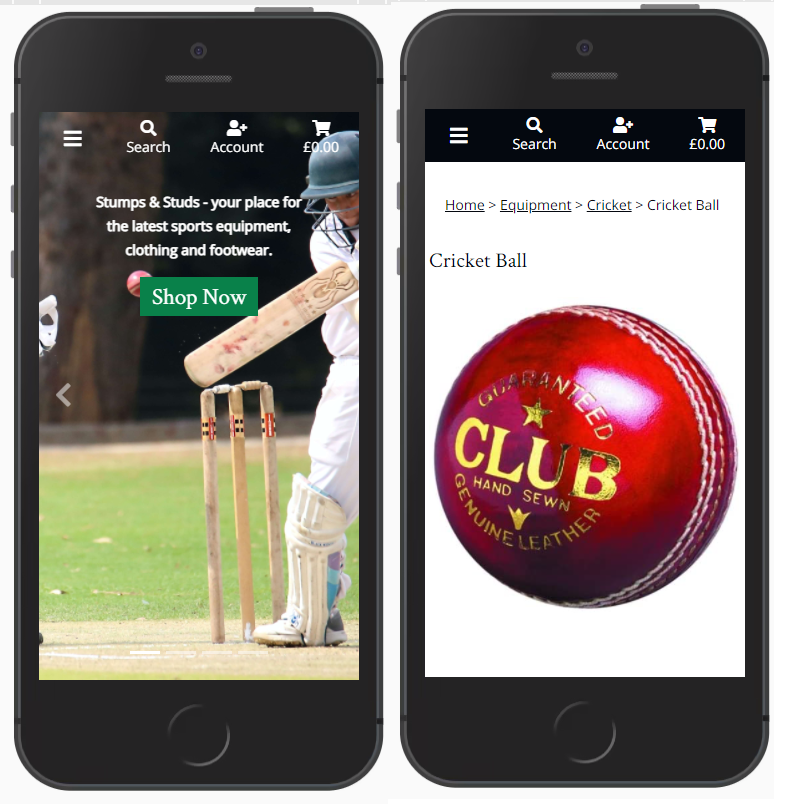

On the home page, when the user starts scrolling down, the header remains at the top of the screen and the background returns to black so that the elements continue to stand out:

#### Navbar

Utilising jQuery, I added a feature which hides the navigation bar when users scroll down but makes it dropdown (reappear) as soon as they begin scrolling up.  This effect is only applied to medium screens upwards since on small screens, the navigation options are hidden (collapsed) behind the menu button and can be accessed by toggling this button.  As outlined above, I wanted to maximise the amount of space on screen for the products to take center stage.  I feel this solution offers good user experience since it means they do not need to scroll up to the very top of the page to access the navigation elements.

However, I did decide that there are some navigation elements which should always be visible to the user and hence I included them in the header which is fixed to the top of the screen throughout the website.  The navigation links I wanted visible at all times are the search form, basket, registration, login and account.  These all feature prominently in my user stories hence wanted to ensure visitors to my website can see them at all times and never have to hunt around for them.

#### Toasts

The toast success message includes a preview of the basket and a link to the basket page for users to quickly checkout.  I fixed the height of the toast basket and gave it the Bootstrap overflow-auto class.  This means users have a preview of their basket they can scroll through without too much screen real estate being used up.  I used Bootstrap's grid layout to make the basket preview responsive.  The success message is used to show users when an item has been added to their basket, a quantity amended or an item has been removed from their basket.

I decided that for warning, info and error messages, it was not necessary to show users the contents of their basket.  Furthermore, I also chose to only display the basket preview in the success toast to users when they are on a Product page.  When amending basket items from within the Checkout, there is no need to display a basket preview in the toast as it is already displayed in the Checkout page.  Elsewhere, success messages are generated when users update details related to their account and though they may have items in their basket, I decided it was not appropriate to show a preview within the toast.  Instead, the success messages displays according to the action they've successfully undertaken:

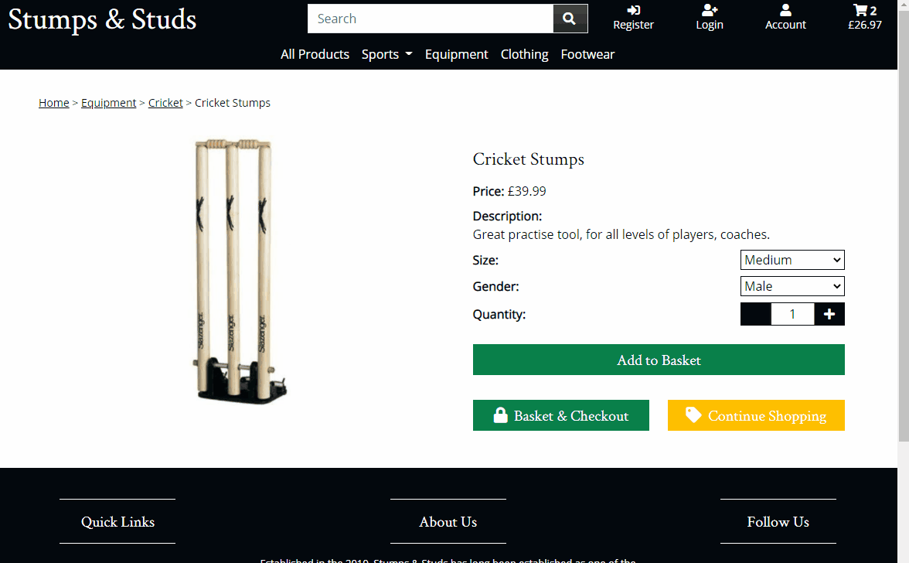

NB: In the GIF above, the cricket stumps have a size and gender.  These attributes were added to the product so I could test the messages and basket quantities updated as desired.  In the final project, cricket stumps do not have size or gender attributes.

### Wireframes

Prior to coding anything, I created wireframes for my prject using Balsamiq.  A PDF version of my wireframe can be found [here](media/readme/ms4-project-wireframe.pdf).

## Code

[**Back to Contents**](#Contents)

### Settings

The settings.py file is where the global settings for the project are configured.  Django creates a lot of these by default but there were some changes/additions which needed to be made as I developed the project.

*   **Installed Apps**:  For each new Django app I created, the app name needed to be added to the list of installed apps (INSTALLED_APPS).  Other apps such as Crispy Forms and Django Storages have also been added to the list so Django knows they are trusted apps which can be used.
*   **Django AllAuth**:  AllAuth can be configured in the global settings.py file.  Installation instructions for AllAuth can be found [here](https://django-allauth.readthedocs.io/en/latest/installation.html) and configuration instructions can be found [here](https://django-allauth.readthedocs.io/en/latest/configuration.html).
*   **Stripe**:  I followed the [Stripe documentatin](https://stripe.com/docs/payments/accept-a-payment) and the detailed [Code Institute Boutique Ado mini-project](https://learn.codeinstitute.net/courses/course-v1:CodeInstitute+FSF_102+Q1_2020/courseware/4201818c00aa4ba3a0dae243725f6e32/90cda137ebaa461894ba8c89cd83291a/) instructional videos to set up the payment system.  This is a test set up (rather than live) so cards will not actually be charged.  There are a variety of test payment card numbers provided in [Stripe's documentation](https://stripe.com/docs/testing#international-cards) which can be used to simulate a successful payment.  A Stripe public key (STRIPE_PUBLIC_KEY), Stripe secret key (STRIPE_SECRET_KEY) & Stripe webhook secret (STRIPE_WH_SECRET) are required to connect to Stripe but these are all stored as environment variables in both GitPod and Heroku as I don't want to share these publicly.
*   **AWS**:  I use Amazon Web Services (AWS) to host my static and media files for the deployed site (on Heroku) in an S3 bucket.  I have configured my global settings to enable my app to connect to it when deployed.  In Heroku, I have created a number of environment variables including USE_AWS which is set to True.  An 'if' statement in my global settings checks if this exists in the environment and if so, configures my app to use the AWS S3 bucket for static and media files.  I closely followed the videos in the Deployment section of the [Code Institute Boutique Ado mini-project](https://learn.codeinstitute.net/courses/course-v1:CodeInstitute+FSF_102+Q1_2020/courseware/4201818c00aa4ba3a0dae243725f6e32/d90bfac64e564b41a177b65c34a63502/) to set this configuration up - more detailed steps are explained in my [Deployment](#deployment) section below.
*   **Gmail Email Account**:  In order to actually send emails to users, I have configured the global settings to connect to my Gmail account.  The email address (EMAIL_HOST_USER) and Gmail app password (EMAIL_HOST_PASS) enable my app to connect to my Gmail account and these are set up as variables which are retireved from the Heroku environment so as to keep them private.  They are only required in the Heroku environment since I have configured the global settings to use the default Django email confifuration if in a development environment such as GitPod, otherwise the Gmail settings are used.

### File Structure

The project is split into apps.  Each app has files (such as forms, models, urls and html files) which are specific to that app.  However, there are some common files which we want apps to inherit from or which don't necessarily belong within one of the apps.  These are stored in the templates folder.

Each HTML file extends from the base.html file which is saved in the templates folder.  Toast templates are also stored within the templates folder.

The templates folder contains an 'allauth' subfolder which contains a number of the allauth template html files.  These were copied from the AllAuth site-packages directory using the following command before I then deleted the AllAuth openid and tests templates:

*cp -r ../.pip-modules/lib/python3.8/site-packages/allauth/templates/* ./templates/allauth*

I subsequently modified the base.html AllAuth template so that the style of my website is inherited through all of the AllAuth templates.  I further modified some of the individual AllAuth templates to ensure my desired styling on all pages.

### Static Files

I have an app (folder) called static which stores the base.css and base.js files as well as some media files for the home page and a loading gif which is used when the checkout form is submitted.

I could have created a static folder within each app and created a CSS and JavaScript file within it, specifically targetting each app.  For the CSS, I try to re-use rules and class names and thus found it easier to contain all of my custom CSS in the base.css file within the static app.  I have used comments to partition the base.css file so that I can easily identify rules which are specific to each app.  Whilst I could have split this out across multiple lines, it was my personal preference not to do this.

However, for the JavaScript I found it easier to partition this between each app.  There are a couple of ways I have done this; sometimes I have included a script within html files which extends the postload_js block from the base HTML template whilst in other apps, I have created a static folder within the app containing JavaScript files.

For example, I wrote some custom JavaScript in the basket app to allow users to update quantities or remove items from their basket.  This is included in the postload_js block within the basket.html file.  However, for the checkout app, there is custom JavaScript to control the checkout form buttons (which enables users to click through the various tabs) and to process the Stripe elements of the form.  Since there is a considerable amount of JavaScript, I opted to include this in two files housed within a static folder in the checkout app.

All static folders are collected (by collectstatic) when the project is pushed to Heroku and they are stored in my AWS S3 bucket in the deployed version.

## Database Schema

[**Back to Contents**](#Contents)

### Data Scheme

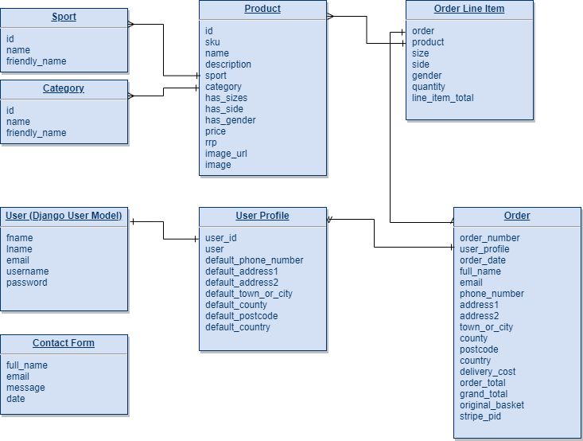

#### Basket Variable in Session Memory

The products my website sells includes sports equipment and clothing.  Clothing items typically have sizes and there are some sports equipment which are specific to male or female.  Furthermore, some equipment is taylored for either right-handed or left-handed users; golf clubs for example.  As such, the products in my database have 3 booleans properties; has_sizes, has_side, has_gender.  These indicate whether or not that product has that attribute.  The attributes determine the options users have on the product details page when shopping for products.  Products can have none of these attributes, some of them or all of them.

The items a user adds to their basket need to retain the properties they have selected.  To do this, I needed to come up with a structure for storing basket items within a variable called basket which is saved in session memory.  The basket variable is a dictionary where the keys are the unique product ID's.  For items without any attributes, the value is simply the quantity that the user has added to their basket {product_id: quantity}.

For items which do have at least one of the three aforementioned attributes (size, side, gender), a different structure is needed.  Since each item a user adds of the same product could have different attributes and be of varying quantities, I opted to store all of these attributes within a dictionary which in turn is within a list.  This list is the value to the product ID key in the basket dictionary: {product_id: [{'size': size, 'side': side, 'gender': gender, 'quantity': quantity},]}.

When adding these attributes to the dictionary, I don't distinguish between products which only have some of these attributes and those which have all.  If a product doesn't have one of the 3 attributes, I asign it the None object.

When adjusting the basket or removing an item, I cycle through the list of dictionary's and check whether the size, side and gender in the dictionary match what the user has submitted and update the quantity or remove the dictionary accordingly.

The view.py file in the bag app contain functions for managing the basket variable; add_to_basket, adjust_basket, remove_from_basket.

The size options users can select from are:
* Junior (jr)
* Extra Small (xs)
* Small (s)
* Medium (m)
* Large (l)
* Extra Large (xl)

The side options users can select from are:
* Right-Handed (right)
* Left-Handed (left)

The gender options users can select from are:
* Male (male)
* Female (female)

#### Contexts

Within the basket app, there is a contexts.py file which is added to the list of context_processors within the global settings.  This makes the variables within it available throughout my website.  Within it, I create variables for the total cost of the items in the basket (total), total number of items in the basket (product_count), cost of delivery (delivery) and the total cost of the items in the basket plus delivery (grand_total).  There is also a list (basket_items) of products which uses the basket variable in session memory to unpack details of the products the user has added to their basket.

The basket_items varable stores the unique product id, the product object from the Products model and a details list.  The details list consists of dictionary's.  If the product has at least one of the size, side or gender attributes, the dictionaries will contain all of these attributes.  If the product doesn't have any of these attributes, the details list will only have one dictionary which will be the quantity.

So for products with no size, side or gender, the structure in the basket_items list is:

{'item_id': product_id, 'product': Product(object), 'details': [{'qty': quantity}]}

For products which have at least one attribute (either size, side, gender),  the structure in the basket_items list is:

{'item_id': product_id, 'product': Product(object), 'details': [{'qty': quantity, 'size': size, 'side': side, 'gender': gender}]}

The data structure allows for product details, quanities and where applicable, attributes to be unpacked in the basket page using Jinja.

## Features

[**Back to Contents**](#Contents)

### Existing Features

- Admin:  There are two levels of users for my website; superusers and active (standard) users.  Superusers are administrators for the site who have access to the Django Admin panel.  Superusers can access this from the Account dropdown in the header through a link labelled Site Admin but this will not be visible for active users (or anyone who is not logged in to an account).  From the Admin panel, superusers can:
    - Add new Products, amend or delete existing Products.
    - Amend the status of other users and/or delete them.
    - Verify and/or delete email addresses.
    - View all orders as well as delete them or modify them including amending or removing items and adjusting quantities.
    - View and delete messages (submitted via the contact app).
    - View, amend and/or delete User Profiles.

- Search:  In the Header, there is a search form which allows users to search for items my Stumps & Studs business sells.  The search returns any products which contain the search string in either the product name or description.  For example, entering 'bat' in the search form will return 4 results including Cricket Pads since they contain the phrase 'Batting Pads' within their description, and the Football Pump because its description contains the word 'batteries':

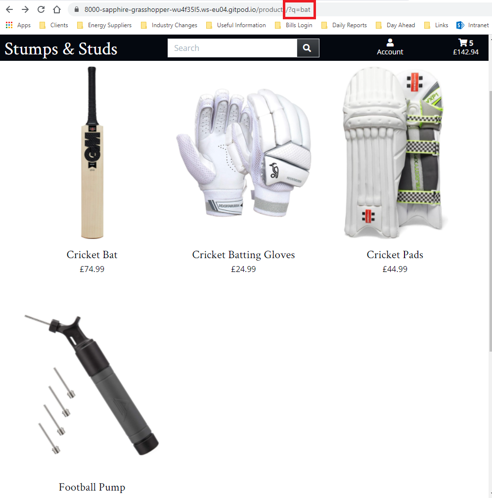

- Stripe:  I have used Stripe to implement a payment processor so users can complete a checkout process.  I have not implemented a live payment system, only a test one meaning cards will not be charged.  To mimic a successful payment, users can enter any of the [Stripe test card numbers](https://stripe.com/docs/testing#international-cards) - the card number for the UK is 4000008260000000.  The expiration date can be any future date while the CVC and postcode can be anything.

- Stripe Webhook:  A Stripe webhook handler has been developed so that if the checkout process is interrupted for any reason, situations where a users payment is processed but their order isn't placed are avoided.  When a successful payment is received by Stripe, a webhook is sent.  I capture this and check the Orders model to see if the order is stored there, in which case the order was placed before any interruption.  If the order is not in the Orders model, this means successful payment was received by Stripe but then an interruption prevented the order from being added to the Orders model.  Fortunately, the Stripe webhook provides details of the order meaning in these such scenarios, the order can still be added to the Orders model.

- My Account:  Logged in users can access My Account through the Account dropdown in the header.  In the Account page, users can view their default delivery address and phone number, view previous (historic) orders and also reset their password.

- Contact Us:  Users can contact Stumps and Studs by completing a form.  The email address the user provides then receives an automatic email notification confirming that the message has been received.  This notification includes a copy of the message.  For an actual business case, I would configure this so that the company mailbox (e.g. contactus@stumpsandstuds.com) also receive a copy of the message via email which would enable a member of staff to then reply to the customer (user).

### Features Left To Implement / Known Bugs

- I would like to add more products to the project, for example there is a limited amount of footwear and clothing.  I would also like to add items of clothing which are spefically for male or female customers.
- If I were to add items which were just for males or females, I would add another field into the Products model called gender, which for items which have a gender, there is a choice of male, female or both.  A womens t-shirt would have the value of female however golf clubs which can be male or female would have the value of both.  In the frontend, I would then like to enable users to filter products by gender.  I would have a drop down on the navigation bar where users can select male or female and return any products which are specific to that gender plus any that can be either (e.g golf clubs).
- Another future development would be to add a stock count field to the Product model.  In a real-world scenario, a business would want to prevent customers from ordering products when they are out of stock and possibly warn users when stock is low.  Each time an item is bought, the stock count would need to be reduced by the quantity.  Once the stock count is 0, I would then either prevent the product appearing in the frontend or amend the display so users can see it is out of stock and prevent them from adding it to their basket.
- Another feature I didn't have time to implement is to give users the option to subscribe to a mailing list.  Many businesses wish to frequently contact customers with marketing emails so this would be a useful feature.
- One bug I encountered and haven't had time to resolve is on the Products page.  On large screens, the products are laid out in 3 columns by default but users have the option to switch to 2 columns wide - this makes the images larger.  However, whenever the user refreshes the page or uses the Sort By dropdown, the page reverts back to the default layout.
- On small and medium screens, the navbar and search form both appear as dropdowns which users can toggle with buttons on the header.  These both reveal smoothly.  However, the dropdow menu for the Account, Sports and Sort By (on the Products page) all just appear with no smooth visual effect.  Given more time, I would have explored ways to make these have the same effect as the navbar and search form.
- On the Products page, the Sort By dropdown has a different hover effect than the Account and Sports dropdown.  The dropdowns on the Product Details pages also have this same problem.  This is a because both utilise a *select* input with *options* which cannot be styled in CSS.  There may be a solution which utilises JavaScript but given the deadline for this project, I was not able to explore it.
- On the Product Details page, I would have liked to have the dropdowns start with 'Please Select' rather than a default selection such as Medium for size.
- On the Home page on small and medium screens, the header is transparent when scrolled to the top of the page.  I implemented a JavScript solution so that when the user clicks the menu buttom and the navbar is revealed, the header loses it's transparency and then gains it again when they close the menu bar.  However, if the user scrolls down the page, then clicks the navbar to reveal the menu and then scrolls to the top of the page (with the navbar still expanded), the header regains its transparency.  This is something else I ran out of time to fix:

- In my project, administrators (superusers) can update the Products model through the admin panel.  Given more time, I would have liked to enable superusers to have full CRUD functionality over the Product models through the frontend.
- On the Contact page, I wanted to utilise an API to show the a location for Stumps & Studs head office.  I would have added this if I had more time before my deadline.

## Languages

[**Back to Contents**](#Contents)

* HTML
* CSS
* JavaScript
* Python

## Technologies & Services Used

[**Back to Contents**](#Contents)

 - [Django](https://www.djangoproject.com/)
 - [Bootstrap5](https://getbootstrap.com/)
 - [jQuery](https://jquery.com/)
 - [Django AllAuth](https://django-allauth.readthedocs.io/en/latest/)
 - [Pillow](https://pillow.readthedocs.io/en/stable/index.html)
 - [Crispy Forms for Bootstrap5](https://github.com/django-crispy-forms/crispy-bootstrap5)
 - [Django Countries](https://pypi.org/project/django-countries/)
 - [DJ Database URL](https://pypi.org/project/dj-database-url/)
 - [Psycopg2](https://pypi.org/project/psycopg2-binary/)
 - [Gunicorn](https://pypi.org/project/gunicorn/)
 - [Boto3](https://pypi.org/project/boto3/)
 - [Django Storages](https://pypi.org/project/django-storages/)
 - [Heroku](https://heroku.com/)
 - [Postgresql](https://www.postgresql.org/)
 - [Gmail](https://mail.google.com/mail/)

## Testing

[**Back to Contents**](#Contents)

### Bugs Encountered During Development

#### Search Placement

Whilst building the header and navbar, I wanted the search box to be appear and disapear via a toggle button.  However, I only wanted this to apply to small screens; on medium screens (768px) upwards, I wanted the search box to remain visible in the header.  I initially tried to achieve this with jQuery applying jQuery UI effects to achieve a smooth dropdown transition.  The problem I encountered here was getting the search box to not be visible by default on small screens but always be visible on large screens.

I added the classes "d-none" and "d-md-block" to the #nav-search element.  This ensure that the elements initial state was correct.  However, getting jQuery to override the "d-none" class on small screens was a challenge.  I tried chaining toggle effects with toggling classes too to add/remove the "d-none" class.  However, this meant the transition was not smooth; the element would show after the effect had been applied or be hidden before the effect had been applied.

I ended up utilising [Bootstrap's collapse](https://getbootstrap.com/docs/5.0/components/collapse/) component to reach a solution.  Applying the "collapse" class to the #nav-search meant I could control have it hidden by default but toggle it's visibility using the #search-button element in the header.  I changed the #search-button to a button rather than a div to ensure semantic rules were followed and then applied some Bootstrap classes and custom CSS to achieve the desired styling.  Finally, I after the "collapse" class, I added the class "d-md-block" to the #nav-search element.  The reason for this is to ensure that it is always visible on medium screens upwards.  Whilst the visibility of this can still be toggled by the #search-button, this element is hidden on medium screens upwards so it cannot be clicked.

#### Header Account Button Position on +Medium Screens

On medium screens upwards, the header contains a Stumps and Studs anchor link, the search bar and links to enable users to login, logout, access their account page and view their basket.  I wanted to keep the basket visible always in the top-right corner of the header.  The other links between the search bar and basket link vary depending on whether a user is logged in or not.  When the user is not logged in, there are 3 links; Register, Login and the Basket.  I want to entice users to either register for an account or login so opted to have these visible in the header at all time.  When the user is logged in, there are 2 links; Account and Basket.  The Account link is actually a dropdown which has two links; one for My Account and one for Logout.  I could have had these as two separate links but I don't want the Logout link to be visible as I don't want to entice users to logout.  Below is a screenshot showing the header including the navbar on medium screens, firstly when a user is logged in and then when a user is **not** logged in:

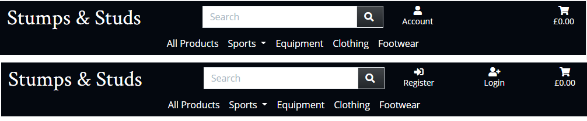

The container for the links is a flex box utilising [Bootstrap's flex classes](https://getbootstrap.com/docs/5.0/utilities/flex/#justify-content).  I use the class 'justify-content-between' to space the links out.  When they are logged out, the 3 links are evenly spread out but when users are logged in, I felt that the Account link was spaced too closely to the search bar.  I considered adding some margin to the left of the Account link but this didn't create the desired effect.  I wanted to center the Account link between the search bar and Basket link.  The simple solution I utilised was to create an empty div before the Account link which means the flex box evenly spaces 3 elements out thus pushing the Account link into the center.  To ensure the layout on small screens isn't effected, I used Bootstrap classes 'd-none d-md-block' to ensure it doesn't displace any links on small screens.  The end result is below with the change being seen in the header when users are logged:

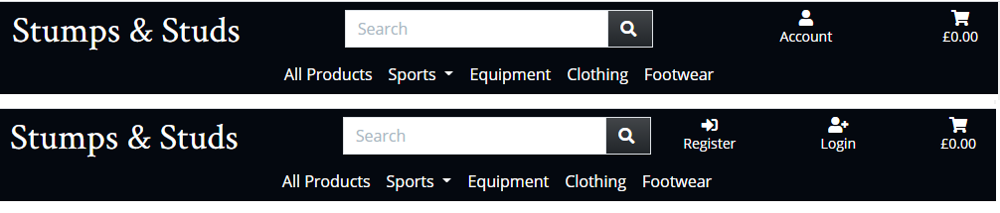

#### Navbar JavaScript

On medium screens upwards, the navbar sits below the header whilst on small screens, it is shown/hidden using the menu button in the header.  On medium screens, I wanted the navbar to disappear when users scrolled down and then reappear when they scroll up.  The reason I wanted to do this was to preserve real estate space on screen.  To help achieve this, I referenced a solution on [w3schools.com](https://www.w3schools.com/howto/howto_js_navbar_hide_scroll.asp).

However, since I only wanted to apply this effect on medium screens upwards, I check the screen width.  If the screen width is greater than or equal to 768px, the effects are applied depending on the direction of scrolling.  However, when I tested the result of this effect, I noticed a bug.  When scrolling down on a medium screen, the navbar is hidden.  If the user then changes the screen size to a small screen, the navbar remains hidden and can no longer be toggled by the menu button:

To resolve this, I searched Google and found another function I could use to resolve the problem.  Since this unique bug only occurs when the user changes the screen width, I created a function which is called every time the screen is resized.  I read up about the resize() method on [w3schools.com](https://www.w3schools.com/jquery/event_resize.asp).  When the screen is resized, I check the screen width again and if it is less than 768px, I show the navbar.  This means it can be toggled by the menu button as desired:

#### Remove from Basket

To remove items from the basket in the Basket page, JavaScript is utilised to post data and remove an item from the basket.  Using if statements, hidden data is included in the post data for the items size, side and gender as applicable.  The remove_from_basket function in the bag app views.py file is called to handle the request.  Within the function, I check whether any size, side or gender has been provided.  If not, I remove (pop) the item from the basket variable stored in session memory.  If it does have any one of these variables, then the product must have details so the value in the basket dictionary will be a list.

I cycle through the list of dictionary's and search for the item with the corresponding details to delete.  To achieve this, I check each dictionary to compare the size, side and gender variables.  When I find a match for all 3, I remove the dictionary from the list.  The issue I encountered when building this function is that where there is no such variable, rather than the None object being passed to the function and None string is passed.

As an example, if I had cricket gloves in my basket which have a size and side but no gender, the size and side passed to the remove_from_basket function were correct but the gender was a None string.  When cycling through the dictionary's in the basket, any cricket gloves in there will have a size and side but the gender is a None object.

When comparing each detail to check for a match, I never achieved one since the gender None string is not equal to the gender None object in the basket.  To overcome this, I inserted a series of if statements at the start of the function.  Once the size, side and gender variables have been retrieved from the request, I check each of them in turn to see whether any of them are equal to a None string (e.g. if size == 'None':), and if so, make the variable equal to the None object (size = None).  This meant that when checking the dictionarys for an item which matched the one the user is trying to delete, a match was found and the dictionary could then be removed.

Finally, to ensure that no empty lists are left in the basket, I check see if there are any of that product left in the basket and if not (e.g. the list is empty), I remove it from basket.

#### Toasts - Positioning

When creating the toast messages, I decided I wanted them to appear beneath the header but with a fixed position on top of existing content.  To achieve this, I gave the toast box a fixed position and z-index of 9999999 to ensure it overlays all other content.  Setting the position relative to the top of the page was a little tricky though.  The header height varies; on small and medium screens it is 53 pixels while on larger screens it varies between 53 pixels and 93 pixels depending on if the navbar is visible.  By setting the position to the top at 93 pixels, there would occasionally be white space between the header and the toast which I don't think looks very good:

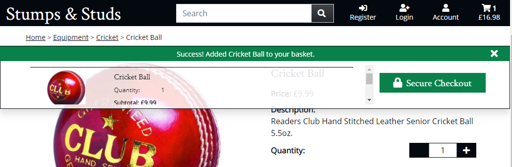

To resolve this, I utilised jQuery and CSS.  Within my base.css file, I set the toast position to 93 pixels from the top but used a media query to reduce this to 53 pixels on screen sizes up to 768px wide.  Then, using the jQuery functions I created to hide and show the navbar on large screens, I add and remove a class to the toasts called 'toast-up' which changes the position to the top of the page to 53 pixels.  By setting the same transition speed to the navbar hide/show and the toast add/remove class, the toasts move up and down in line with the navbar on large screens but sit under the header on small and medium screens:

#### Toasts - Display Basket Preview

As mentioned above in the Design Decisions section, I opted to only display the basket preview in the success toasts but only when the user is on a Products page.  To achieve this, I added a new variable to the product views context called 'toast_basket_preview' which is set to True.  Then within the toast_success.html file, I added a Jinja if statement which checks to see if this variable is true and whether there are any items in the basket.  If this criteria is satisfied, then the basket preview displays in the toast success message.  Otherwise, only the message appears and the basket preview does not.

If I choose to include the basket preview on other pages in future, it is quite a simple solution.  All that needs to be done is pass the 'toast_basket_preview' variable to the context and set its value to True.

#### Order Grand Total

As I develpoed the checkout models, I stumbled upon an issue with the format of my order total (order_total) and the delivery total (delivery_cost).  The order total is the sum of all of the order items multiplied by the corresponding quantities.  It uses the Django DecimalField to store the value as a decimal.  The delivery cost comes from the global settings but is a float with value 6.99.  When adding the two values together to get the grand total (grand_total), I received the below error caused by trying to add two variables of different type together:

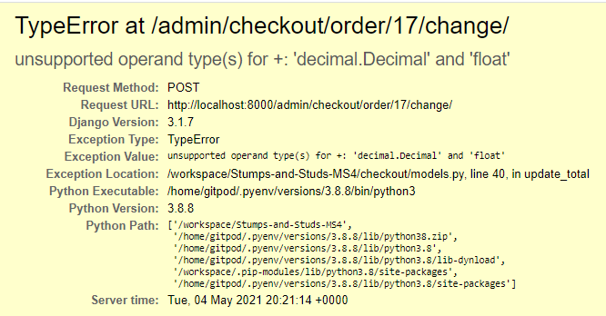

To overcome this, I turned to Google and found a [simple solution](https://stackoverflow.com/questions/316238/python-float-to-decimal-conversion).  I decided to convert the delivery cost variable into a decimal.  To achieve this, I simply imported the Decimal function (from decimal import Decimal) and passed the delivery cost variable into it.  Doing some further reading, I discovered that simply converting a float to decimal often introduces a rounding error.  Whilst the grand total is stored as decimal too with 2 decimal places so any rounding errors shouldn't cause an issue, I read that best practice is to convert the variable to a string before converting it to decimal.  Using the print function, I compared the outputs when converting the delivery cost to decimal:

6.9900000000000002131628207280300557613372802734375

When converting the delivery cost to a string and then a decimal this was the output:

6.99

I decided it was best practice to convert the delivery cost to a string and and then a decimal.  With the delivery cost now the same variable type as the total cost, both decimal, I was able to successfully add the two variables together.

#### Checkout Success

In the Checkout page, I created tabs using [Bootstrap](https://getbootstrap.com/docs/5.0/components/navs-tabs/#javascript-behavior) so that users can enter personal, delivery and payment details on separate tabs.  I used JavaScript to enable functionality so users can click either the tabs or previous/next buttons to navigate through each step of the process.  This is housed in checkout_form_buttons.js within the static folder in the checkout app.  I prevent users from moving onto the next step unless there is a value in all required fields.  Originally, I created functions which were triggered when there is any input on a required field.  After I completed the profiles app, I noticed a bug with this.

The profile app allows users to save the default delivery information which the checkout app can retrieve and pre-populate the form with.  This meant that the checkout app could be loaded with all of the required fields in the edlivery tab already populated.  Since the next button on the delivery tab and 'Summary & Pay' tab are both disabled by default when the page loads, users cannot move onto the final tab unless they input something (i.e. change the default value) in one of the required fields:

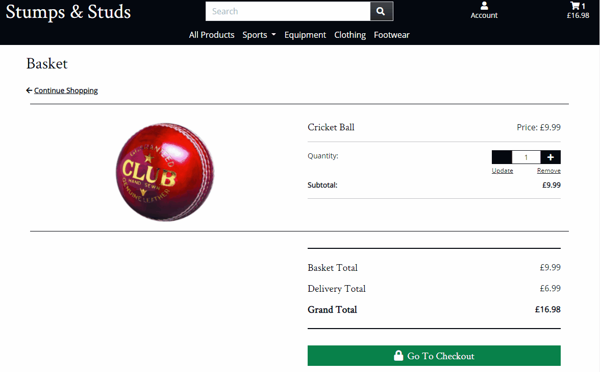

To resolve this issue, I added another JavaScript function which checks the required fields on loading and updates the buttons and tabs accordingly.  This means that if the required fields in the delivery tab are already populated, the next button and 'Summary & Pay' tab are both enabled, thus improving the user experience:

#### Checkout Success

On the checkout success page, the product details (side, size and gender) all appeared as the value entered into the basket when a user adds a product in the product details page.  For example, the sides were left or right, rather than left-handed or right-handed.  Furthermore, in the admin panel, these 3 detail fields were free text fields meaning a user with access to the admin panel could enter any value.

To overcome this, I changed the product_size, product_side and product_gender in the OrderLineItem models within the checkout models.py file.  I changed these fields from Charfields with a maximum length of characters to fields with choices referring to the [Django documentation](https://docs.djangoproject.com/en/3.2/ref/models/fields/#choices).  After making the migrations, when adding a line item to an order from within the admin panel, users are now restricted to only select from the choices defined:

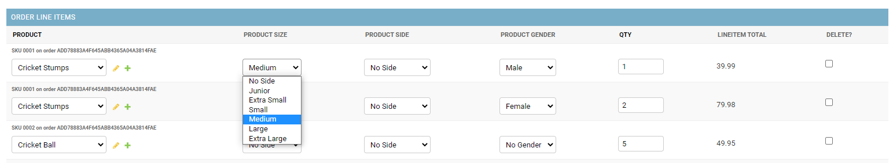

One drawback with this approach is that not all products have sizes, sides or gender but these inputs are not restricted in the admin model.  For example, an admin user could apply a gender of male to a product which doesn't have this attribute such as a cricket ball.

Secondly, I used the get_FOO_display method to display the 'human-readable' value of the choices field - again I reffered to the [Django document](https://docs.djangoproject.com/en/3.2/ref/models/instances/#django.db.models.Model.get_FOO_display) for a solution.  Here is the checkout success page before and then after these changes were made:

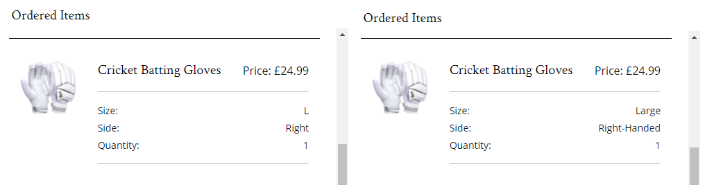

#### Basket Quantity

The quantity of each item can be increased or decreased from the Basket page through increment and decrement buttons.  The behaviour and functionality is controlled using JavaScript, specifically the qty_input_script.html file within the includes folder in the products app (this script also provides the same functionality in the Product page).  The bug I encountered on this page was that the disable and increment buttons would only be enabled/disabled as expected on the first item of a product type.  In the screenshot below, there are multiple Cricket Stump items and multiple Batting Glove items within the basket.  There is 1 of each item meaning the decrement button should be disabled.  This is only the case for the first instance of each product:

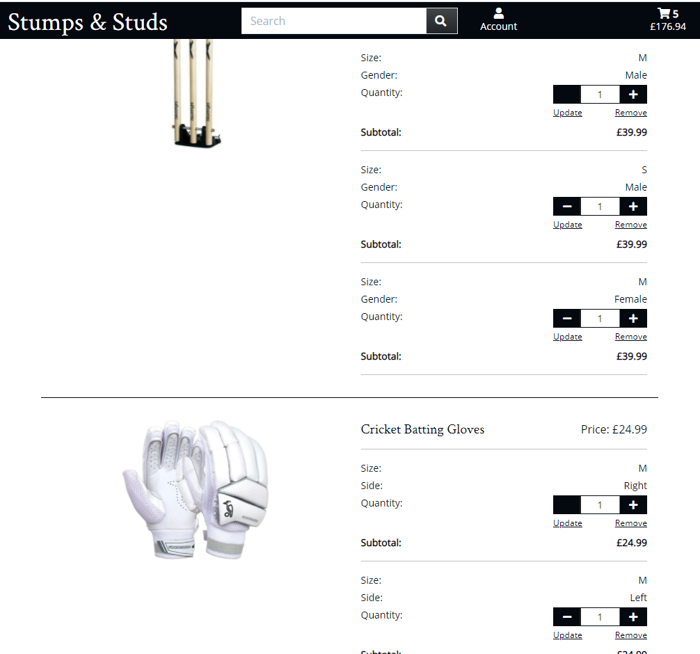

Upon closer inspection, I identified that the cause of the issue was the id of each quantity input (with class .qty_input).  The id was *id_qty_* followed by the product id number.  This meant that where multiple items for the same product were in the basket, there would be multiple inputs with the same id.  Since the JavaScript utilised the id to target the element and enable/disable the decrement and increment buttons, only the first instance had the proper functionality applied, hence the result in the above screenshot.  Since the Products page only have only product on them, this wasn't an issue on that page but in the Basket page, this needed addressing.

To resolve this, I needed to make the id of each input element unique.  Since each item it displayed to the Basket page using a Jinja for loop, I found a [solution online](https://stackoverflow.com/questions/35343881/jinja-loop-index-does-not-print) which enabled me to easily add the loops iteration number to the end of the id such that each one is now unique (*id_qty_{{ item.item_id }}_{{ forloop.counter }}*).  I needed to amend the data-item_id attribute of the input.  Having made these changes to the input, I replicated them on the decrement and increment button to ensure each had a unique id and the correct element is targetted by JavaScript.  This enabled me to get the desired end result:

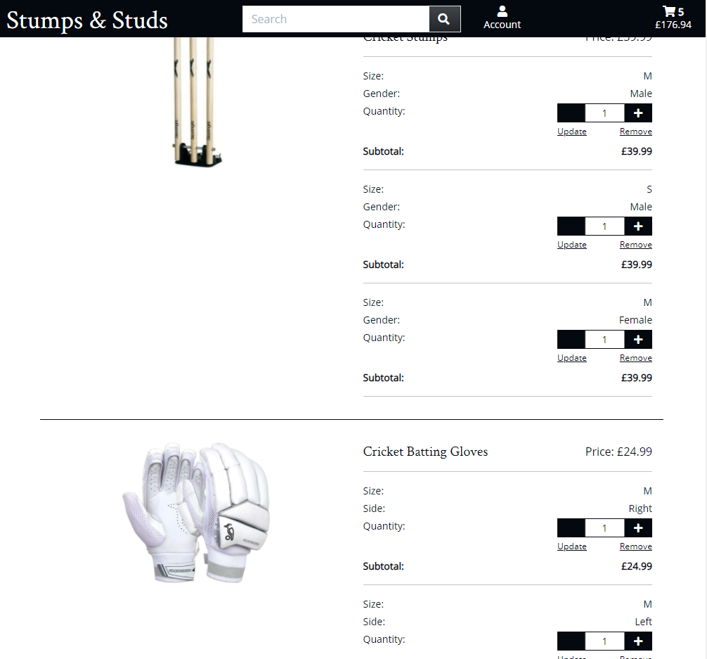

### Testing Process

*Try to use an Aim, Methodology, Result layout. A user should be able to read the Testing document, carry out the same tests on the live site and get the same results.  Try testing the user stories comprehensively in terms of Features and Responsivity to get a better grade.  Include evaluation of bugs found and their fixes and explanation of any bugs that are left unfixed.  Test the UX thoroughly.*

#### Responsive Design

* Basket page is responsive but the quantity buttons begin to misalign when the screen width is reduced down to 332px wide.  However, I believe this is not an issue since [modern mobiles](http://www.javascriptkit.com/dhtmltutors/cssmediaqueries2.shtml#:~:text=Most%20mobile%20phones%20have%20a,CSS%20pixel%20on%20the%20screen.) are wider than this.

#### Checkout Form

Test what happens if users refresh or closes page after clicking Complete Order (submitting form).
Try using different Stripe payment card numbers.

### Bugs Encountered During Testing

## Deployment

[**Back to Contents**](#Contents)

### GitPod Environment

I created my GitHub repository (repo) by using the [Code Institute template](https://github.com/Code-Institute-Org/gitpod-full-template).  I named my repo "Stumps-and-Studs-MS4".  I opened this repo in GitPod.

### Packages Installed

From within GitPod, I installed a number of packages:
*   [Django](https://www.djangoproject.com/) - *pip3 install django*
*   [Django AllAuth](https://django-allauth.readthedocs.io/en/latest/) - *pip3 install django-allauth*
*   [Pillow](https://pillow.readthedocs.io/en/stable/index.html) - *pip3 install pillow*
*   [Crispy Forms](https://github.com/django-crispy-forms/crispy-bootstrap5) - *pip3 install django-crispy-forms*
*   [Crispy Forms for Bootstrap5](https://github.com/django-crispy-forms/crispy-bootstrap5) - *pip3 install crispy-bootstrap5*
*   [Stripe](https://stripe.com/docs/api) - *pip3 install stripe*
*   [Django Countries](https://pypi.org/project/django-countries/) - *pip3 install django-countries*
*   [DJ Database URL](https://pypi.org/project/dj-database-url/) - *pip3 install dj_database_url*
*   [Psycopg2](https://pypi.org/project/psycopg2-binary/) - *pip3 install psycopg2-binary*
*   [Gunicorn](https://pypi.org/project/gunicorn/) - *pip3 install gunicorn*
*   [Boto3](https://pypi.org/project/boto3/) - *pip3 install boto3*
*   [Django Storages](https://pypi.org/project/django-storages/) - *pip3 install django-storages*

Not all of the above packages were installed immediately upon opening my GitPod but rather they were installed when required during the various development stages of my project.

The project is deployed on Heroku which needs to know which packages to install in order to correctly host my finished project.  I kept an updated list of all of the installed packages in the requirements.txt file using this command:
* *pip3 freeze > requirements.txt*

### Create The Django Project

With Django installed, I created my project by running this command:
*   *django-admin startproject stumps_and_studs .*

To create the various apps, I used the following command:
*   *python3 manage.py startapp* app_name

### Environment Variables

The Code Institute GitPod template already comes with a .gitignore file so I did not need to create one.  Any files listed in this document are not pushed to GitHub which ensures environment variables and the Django default sqlite3 database which need to remain private and secure are not made publicly available within my repo.

Environment variables to connect to Stripe are saved in the Heroku environment and GitPod settings.  By retrieving these values from the environment (os.environ.get), I can ensure they are not saved within any code which would be visible to others on my GitHub account.

Equally, environment variables for connecting to the Postgres database, the AWS S3 Bucket and my Gmail email account are saved in the Heroku environment only as they are not needed in the GitPod environment.

### Setting Up The Database

Django comes with a default database file called db.sqlite3.  For security reasons, this file suffix is listed in the .gitignore file to ensure the database isn't pushed to GitHub.

To update the database when a new models was created, I ran the following commands:
*   *python3 manage.py makemigrations --dry-run* - This tells us what would happen if we actually ran the command.
*   *python3 manage.py makemigrations* - Django sees that we've added a new model to our app so it creates a new Python file in the migrations folder that contains the code to create that database table based on our model.
*   *python3 manage.py showmigrations* - Lists all migrations with [X] indicating those that have been done already and [ ] indicating those that need to be migrated.
*   *python3 manage.py migrate --plan* - Lists all of the changes that will be made to the database and various field settings without executing changes to the database.
*   *python3 manage.py migrate* - Executes the migration and changes to the database are made.

The db.sqlite3 database was used in the development of my project from within the GitPod environement.  The deployed project connects to a Postrgres database.

### Create Admin Superuser

Django includes a built-in admin feature which enables authorised users (superusers) to log in and look at the models (tables) in our database and make changes to the data in them.  To create a superuser, I ran the following command:
*	 *python3 manage.py createsuperuser*

### Deploy Application To Heroku

In [Heroku](https://heroku.com/), I created a new app called 'stumps-and-studs'.  To deploy to Heroku, I installed gunicorn (*pip3 install gunicorn*).  I then created a Procfile which instructs Heroku to run gunicorn and serve the Django app.

Next, using the command *heroku login -i*, I logged into Heroku using my account credentials.  Then I disabled collect static so Heroku didn't try to collect static files when deploying using the command *heroku config:set DISABLE_COLLECTSTATIC=1 --app stumps-and-studs*.  Within the global settings file, I added 'stumps-and-studs.herokuapp.com' to the list of allowed hosts (ALLOWED_HOSTS).

I then commited my changes and pushed them to GitHub before then pushing them to the Heroku master branch using the commands *heroku git:remote -a stumps-and-studs* and then *git push heroku master*.

On the Heroku app dashboard, under the Deploy section, I connected to the main branch of my GitHub repository for this project and set it to automatically deploy so that whenever I push an update to my GitHub repository, it is also updated in Heroku.

Finally, I updated the secret key (SECRET_KEY) in my GitPod environment and added it to the Heroku environment.  I changed the global settings file to retrieve this from the environment and updated DEBUG so that it is True in the development (GitPod) environment but False in the deployed (Heroku) environment.

### Connecting Django Application To Postgres Database

Within the resources tab in Heroku, I added Heroku Postgres to attach a Postgres database to my app.  Back in my Gitpod environment, I installed dj_databse_url (*pip3 install dj_database_url*) and psycopg (*pip3 install psycopg2-binary*) and added both to the requirements.txt file (*pip3 freeze > requirements.txt*).

In order to recreate the Django default sqlite3 database in the Heroku Postgres database, I followed the instructions included in the [Code Institute Boutique Ado mini-project](https://learn.codeinstitute.net/courses/course-v1:CodeInstitute+FSF_102+Q1_2020/courseware/4201818c00aa4ba3a0dae243725f6e32/d90bfac64e564b41a177b65c34a63502/?child=last).  Whilst still connected to the Django default sqlite3 database, I backed it up into a JSON file (db.json) using the command *./manage.py dumpdata --exclude auth.permission --exclude contenttypes > db.json*.

Next, in the global settings file, I imported dj_database_url.  I then commented out the default database configuration within the global settings file and connected my app to my Postgres database.  I checked this had worked correctly using the command *python3 manage.py showmigrations* which showed that all of the models were waiting to be migrated to the newly connected Postgres database.  I then ran the migrations (*python3 manage.py migrate*).

To then import all of the data from the db.json file, I used the command *./manage.py loaddata db.json* which loaded all of the data into the Postgres database.

Within the global settings file, I then created an if statement which checks for the environment variable DATABASE_URL and if it exists, uses it to connect to the Postgres database, otherwise it connects to the Django default sqlite3 database.  Since the DATABASE_URL only exists in the Heroku environment (where it is set to True), when the app is launched from Heroku the Postgres database is used but when working in GitPod, the  default sqlite3 database is used.

### Creating An Amazon S3 Bucket

Having previously signed up to Amazon's AWS Service, I logged into my account and created a new S3 bucket called 'stumps-and-studs'.  Under the Properties tab, I turned off the default option which usually blocks public access.  Next I enabled static website hosting.

Under the permissions tab, I added a CORS configuration which was taken from the instructions provided in the [Code Institute Boutique-Ado mini-project](https://learn.codeinstitute.net/courses/course-v1:CodeInstitute+FSF_102+Q1_2020/courseware/4201818c00aa4ba3a0dae243725f6e32/d90bfac64e564b41a177b65c34a63502/?child=first).  Next, under the bucket policy section, I generated a security policy with the following settings:

Select Type of Policy: S3 Bucket Policy

Principal: *

Actions: GetObject

Bucket ARN:  arn:aws:s3:::stumps-and-studs

Next I clicked Add Statement and then Generate Policy.  I copied the policy into the bucket policy editor.  I modified the Resource value by adding '/*' onto the end.  Then I clicked Save Changes.

Still under the Permissions tab, the next step I took was to configure the access control list.  I selected the list objects permission to be for everyone (public access), then clicked Save Changes.

From the Amazon Services menu, I selected IAM.  I created a new User Group called 'manage-stumps-and-studs'.  In the Policies section, I created a new policy.  I selected JSON, clicked Import Managed Policy, the selecting and importing the pre-built AmazonS3FullAccess policy.  For the Resource key, I changed the default value to a list containing the ARN (as seen above) and the ARN followed by '/*'.  I proceeded to the Review Policy stage of the process where I gave it a name (stumps-and-studs-policy) and description before clicking Create Policy.

Back in the 'manage-stumps-and-studs' group I created earlier, under the Permission tab, I clicked Add Permissions and Attach Policies.  I selected the policy I just created (stumps-and-studs-policy) and clicked Add Policy.

In the Users section, I clicked Add User and created a user called 'stumps-and-studs-staticfiles-user'.  I granted the user Progromatic Access and then proceeded to add them to my group, 'manage-stumps-and-studs'.  I proceeded to the end to Create User.  I downloaded the CSV file which contains the Access Key ID and Secret Access Key.

### Connecting To My Amazon S3 Bucket

To connect my Django project to the AWS S3 bucket, I installed two more packages; boto3 (*pip3 install boto3*) and Django storages (*pip3 install django-storages*).  In the global settings file, I added storages to the list of installed apps (INSTALLED_APPS).

Since the S3 bucket is only needed when the site is deployed to Heroku, I have a variable in the global settings file called USE_AWS which only exists in the Heroku environment where it has a value of True.  Where the is satisfied (i.e. the environment is Heroku), I retrieve the following variables:

 - AWS_STORAGE_BUCKET_NAME = bucket name
 - AWS_S3_REGION_NAME = region name
 - AWS_S3_CUSTOM_DOMAIN = bucket directory
 - AWS_ACCESS_KEY_ID = access key ID
 - AWS_SECRET_ACCESS_KEY = secret access key
 
The values for the last two variables above are retrieved from the Heroku environment to ensure they are not disclosed in my code.

Next, I created a new file called custom_storages.py and created variables in the global settings to override the default location of the static and media files when in the Heroku environment.  These tell Django that in production, I want to use the S3 bucket to store the static files whenever collectstatic runs i.e. when the project is deployed to Heroku.

Having made these changes, the next time I committed and pushed to GitHub, the static files were automatically collected and saved in my S3 bucket where they can be accessed when the project is hosted in the Heroku environment.  A static folder was automatically created in the S3 bucket.

Lastly, I manually created a media folder in the S3 bucket and uploaded all of the site images into it, ensuring that I granted public-read access to all of the images.

### Connecting To Gmail For Email

In my gmail account, I created a new app called ms4-stumps-and-studs.  A new password was generated for the app which I saved as a value in the Heroku environment for the variable EMAIL_HOST_PASS.  I also created a variable called EMAIL_HOST_USER to which I assigned my gmail account.

In the global settings, I created an if statement so that when in the development environment, the default Django email configuration is used meaning emails are printed out in the console.  If not in the devleopment environment (i.e. in the deployed Heroku environment), I use the gmail configuration so that emails are actually issued to the user.  The password for the app (EMAIL_HOST_PASS) as well as the gmail email address (EMAIL_HOST_USER) are retrieved from the Heroku environment.

## Credits

[**Back to Contents**](#Contents)

### Inspiration

### Content

For the About Us section in the footer, I referenced the text on [JD Sports website](https://www.jdsports.my/customer-service/about-us/) but tweaked some elements of my fictional companies history.

### Media

I wanted prominent images to be high resolution so sourced them from sites such as [Pexels](https://www.pexels.com/) and [Unsplash](https://unsplash.com/):

*   [Home Page Cricketers](https://www.pexels.com/photo/man-people-stadium-game-3718433/)
*   [Home Page Golfer](https://www.pexels.com/photo/man-walking-carrying-black-and-red-golf-bag-on-green-grass-field-1325681/)
*   [Home Page Running Shoes](https://www.pexels.com/photo/people-doing-marathon-618612/)
*   [Home Page Clothing](https://www.pexels.com/photo/three-women-kneeling-on-floor-866023/)

Whilst I would idealy have been able to use high resolution images for my products, I struggled to find suitable images for them.  Instead I downloaded them from a variety of ecommerce stores such as [Amazon](https://www.amazon.co.uk/), [American Golf](https://www.americangolf.co.uk/) and [Decathlon](https://www.decathlon.co.uk/):

I used Google to find a 'no image' image.  The one I chose was sourced from [this website](https://www.allianceplast.com/no-image/).

The loading gif used when users submit the checkout form was sourced from [icons8.com](https://icons8.com/preloaders/en/search/sport).

### Acknowledgements
